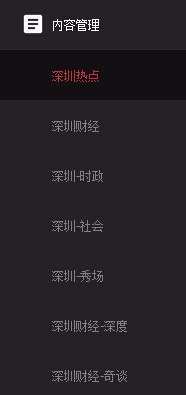
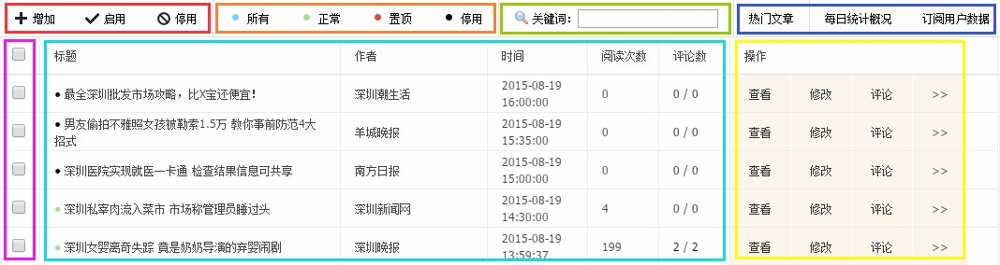

# 频道管理

1. 频道管理放在左侧菜单的**内容管理**模块，点击后可看到自己有权限管理的频道；

2. 点击进入频道后，右侧出现的即为频道频道管理页面，如下图：

  - 浅蓝框部分是文章列表，显示该频道的所有文章，以发布时间排列；

  - 黄框部分是文章操作，默认显示**查看**、**修改**、和**评论管理**三个频繁使用的功能，其他不常用的功能将折叠起来，符合使用习惯，需要时再点击**>>**显示被折叠的选项；

  - 橙框部分是文章筛选，按状态筛选列表中要显示的文章，共3种状态，以颜色区分，显示在文章标题前面，客户端上能看到的（也就是用户能看到的）只有正常和置顶状态的文章；

  - 红框部分是文章管理，**增加**是发布新文章，**启用**是将停用状态的文章启用，**停用**是将其他状态的文章停用；

  - 绿框部分是文章搜索，输入关键词后可搜索该频道内标题中包含该关键词的文章；

  - 深蓝框部分是频道的数据统计，包括**（日/周/月）热门文章**、**每日统计概况**和**订阅用户数据**三大项；

  - 紫框部分是文章选择，使用文章管理功能时，需先选择一篇或多篇文章，最顶端的复选框选中时全选当前页面的所有文章，再次点击是取消选中当前页面的所有文章。

