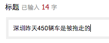
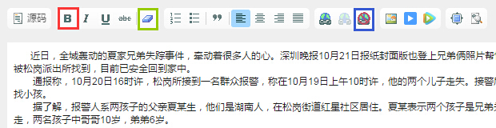
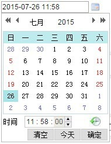
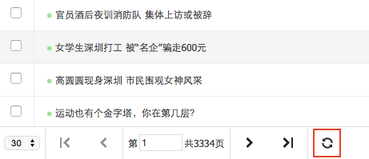

# 发布文章

1. 点击文章管理中的**增加**，页面中间会弹出新文章录入窗口。
2. 填入标题，字数建议控制在22个以内（这里指汉字，2个英文字母或数字=1个汉字，下同），在较小的屏幕下，超出部分可能会被客户端省略。

3. 填入文字内容：

  - 目前通过后台编辑器仅支持添加红色框中的**加粗**样式，其他如斜体、下划线等即使设置了也会被过滤；
  - 客户端会对页面进行统一的排版，通常情况下内容粘贴到后台后不需要再做处理，如果发现显示效果异常，可尝试全选内容，点击绿色框中**清除格式**和蓝色框中的**清除所有超链接**。

4. 填入作者，如果留空系统会显示作者为**未知**，**无特殊情况不要留空！**
5. 选择发布时间：

 - 发布时间决定了这篇文章在列表中的排序，修改发布时间会改变排序；
 - 如果留空，则发布时间为自动设为提交时的时间；
 - 可手动修改时间（直接改那些数字），也可以使用输入框右侧的插件。

6. 填入链接：
 - 填入文章的来源网页地址，点击客户端的**查看原文**会跳转原文网页；
 - 文章为原创且首发在ZAKER时，链接可以不填，**无特殊情况不要留空！**：
    - 链接将用于去重，在一个频道内，无法提交链接相同的文章；
    - 链接也会用于评论采集，匹配全网具有相同链接的文章，采集其评论。

7. 选择状态，状态决定了文章在客户端是否显示，以及什么时候显示：
 - 选择**停用**，文章不在客户端显示，仅出现在后台；
 - 选择**启用**，文章在客户端显示；
 - 选择**定时启用**，文章会在上一步填入的**发布时间**后在客户端显示；
 - 如果选了**定时启用**，但填入的发布时间比当前时间还要早，文章会立刻启用。

8. 检查无误后，点击**提交**即可发布新文章，提交后返回到频道管理页面，点击底部的页面刷新按钮就可以看到新文章。

