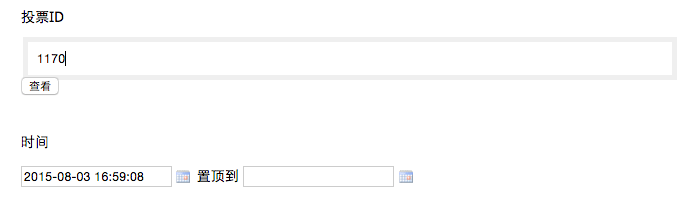
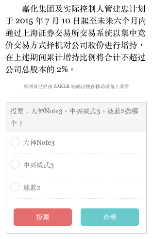

# 插入投票
> 投票只能在已经存在的文章上插入，所以在增加新文章时没有这个选项。

1. 点击文章操作中的**修改**，在**时间**上方有**投票id**的输入框，需要填入一个投票id，暂时需要使用另外的投票后台来，可由ZAKER编辑配合创建。

2. 填入投票id后，可点击**查看**预览投票，投票会出现在文章底部：

 - 投票样式和位置目前都是固定的，后续会逐步优化改进；
 - 上面的预览截图是在手机上查看的效果（PC上查看需将浏览器宽度拉小，或切换到移动设备模式）。 

