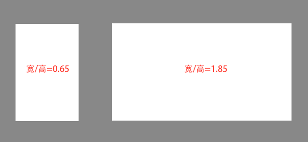
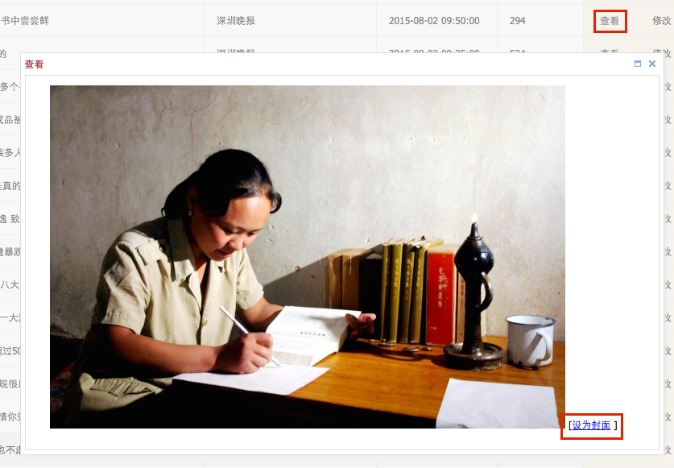
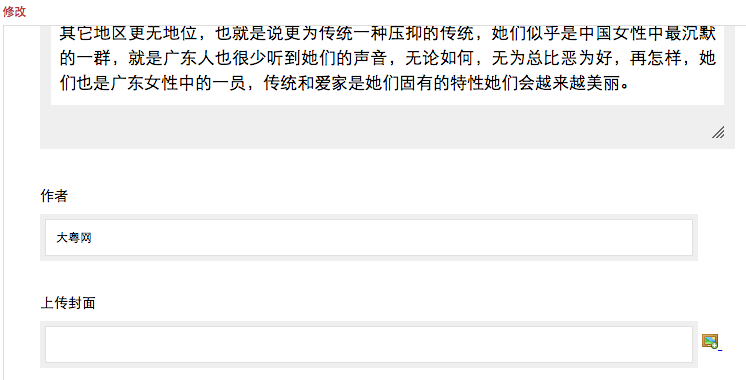
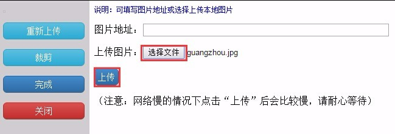
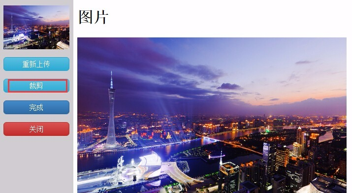
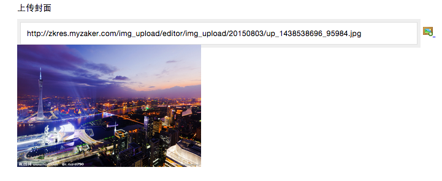

# 设置封面

1. 文章封面即显示在列表的缩略图，在没有无人工设置的情况下，文章封面由系统自动选择：
    - 对于普通频道（块状排版）
        - 每6篇文章为1页，只有一篇文章会显示封面，这个位置也称为焦点位；
        - 系统会让有图的文章排到焦点位，除非6篇文章都没有图；
        - 并非文章内有图就能作为封面，需满足```0.65<图片宽/图片高<1.85```才能作为候选封面，极限情况如下图：
        

        - 默认情况下，文章内第一张符合宽高比限制的图片会被选为封面。
    - 对于集成频道（流式排版）       
        - 同样需要满足```0.65<图片宽/图片高<1.85```才能作为候选封面；
        - 每6篇文章为一组，第1篇有候选封面时显示为大图，没有候选封面显示为无图，第2~5篇有1-2个候选封面时显示为单图，有3或3以上个候选封面时，在小图和三图间随机，没有候选封面显示为无图。

2. 当文章有图但自动选出来的图片不合适时，可进行手动设置：


    - 点击文章操作中的**查看**进行预览，此时可在每张图片右下角看到**设为封面**选项；
    - 点击该选项即可让这张图片成为封面，在不关闭窗口的情况下，可在多张图片上点击，以最后的选择为准；
    - 想要取消人工选择的封面，恢复系统自动选择，需要关闭窗口后再次点击**查看**，此时对应的选项变成**取消封面**；
    - 人工设置封面的操作是无视图片宽高比限制的，也就是说比例多夸张的图片都会被强制设为封面；
    - 对于普通频道来说，是否显示封面由位置决定的，人工选择了封面并不会影响位置；
    - 对于集成频道来说，如果人工选择了封面，第1篇文章的封面一定显示为大图，第2~5篇一定显示为小图。

3. 当文章无图或文章内所有图片都不适合作为封面时，可以上传图片作为封面：
    - 点击文章操作中的**修改**，在作者一栏下面有**上传封面**选项，点击图片icon；


    - 在弹出窗口中点击**选择文件**，选择本地的一张图片，点击**上传**；


    - 上传成功后可看到图片预览，在不关闭上传窗口的情况下还可以做进一步操作：
    
        - 点击**重新上传**再次选择图片；
        - 点击**裁剪**对图片进行调整；
    - 点击**完成**，在修改窗口中可以看到已上传和调整的封面；


    - 对于普通频道来说，是否显示封面由位置决定，人工上传了封面并不会影响位置；
    - 对于集成频道来说，如果人工上传了封面，第1篇文章的封面一定显示为大图，第2~5篇一定显示为小图；
    - ```人工上传的优先级高于人工选择```，即两种人工设置都存在的情况下，以上传的为准。

