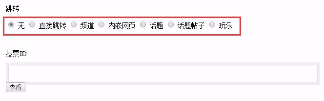
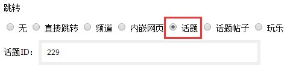
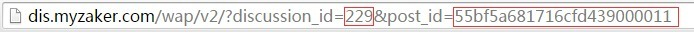
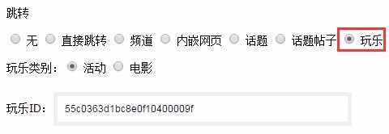

# 文章跳转

> 文章跳转指的是在频道里点击一篇文章时，不是打开文章正文，而是跳转其他类型的页面，满足运营中的推广导量需求，也可以接入ZAKER其他业务或第三方提供的内容。

1. 设置文章跳转需要绑定一篇已存在的文章，点击文章操作中的**修改**，在**上传封面**下有一个选项**跳转**，默认选中**无**，即点击文章标题时是打开文章正文。


2. 选中**直接跳转**将跳转网页，在下方输入框填入要跳转的网页地址。


3. 选中**频道**将跳转频道，在下方输入框填入要跳转的频道id，常用于流量大的频道给流量小的频道导流。


4. **内嵌网页**是插入视频和投票后使用的跳转方式，后台会自动设置，**不需要人工操作**。
5. 选中**话题**将跳转一个话题（ZAKER社区业务），在下方输入框填入要跳转的话题id。


6. 选中**话题帖子**将跳转话题帖子，在下方输入框填入要跳转的话题帖子id和所属话题id：


    - 话题帖子id和所属话题id需要在话题后台获取，在话题后台找到要跳转的帖子，点击**查看原帖**； 
    

    - 在打开的帖子正文页面的地址栏中，```discussion_id```就是话题id，```post_id```为帖子id。
    

7. 选中**玩乐**将跳转玩乐活动（ZAKER生活服务业务），在下方选择活动类型和活动id。


