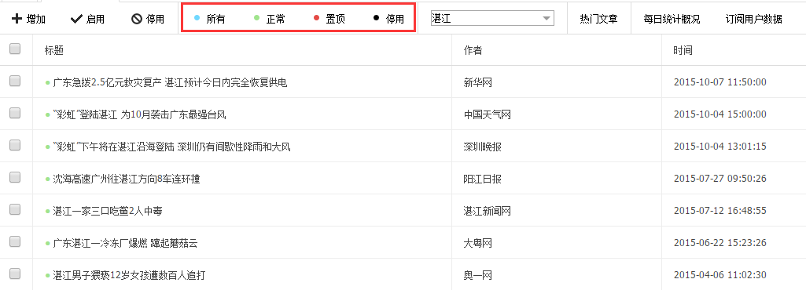
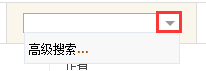
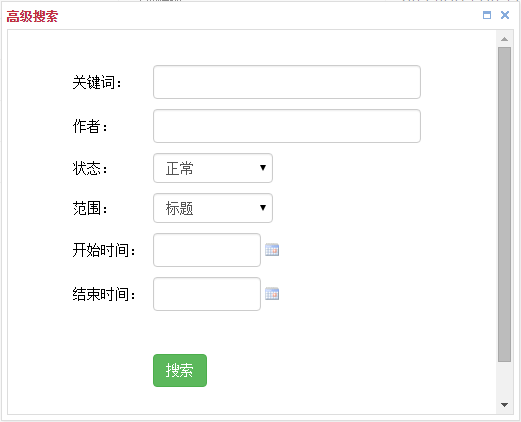

# 搜索文章

文章的搜索范围是频道，即在某个频道内搜索文章，包括普通搜索和高级搜索两种。

#### 普通搜索

1. 直接在输入框填写关键词，回车执行搜索；

2. 文章标题包含有关键词时会被搜索到，不限时间；

2. 搜索时会加上当前的筛选状态（上图红框），例如点击**置顶**后，再执行搜索就是在状态为“置顶”的文章里搜索。

####高级搜索
点击搜索框右侧的小三角，出现下拉菜单，包含**高级搜索**，点击后弹出窗口。

1. **关键词**：要搜索的词，不允许带空格，可留空；

2. **作者**：限定文章的作者，如“深圳晚报”，可留空；

3. **状态**：限定文章的状态，默认是“正常”；

4. **范围**：限定关键词的匹配范围，默认是“标题”，与普通搜索一样，另外i可以选择匹配“正文”和“标题+正文”；

5. **开始时间**和**结束时间**：限定文章的时间，必须包含在开始时间和结束时间之间，可留空。

