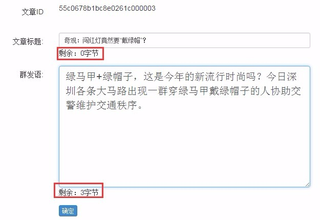
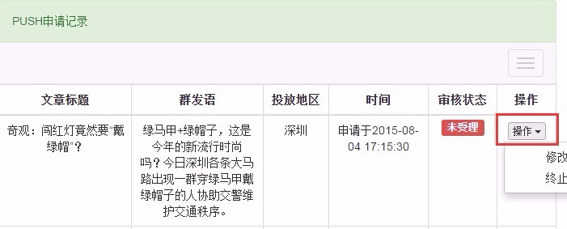
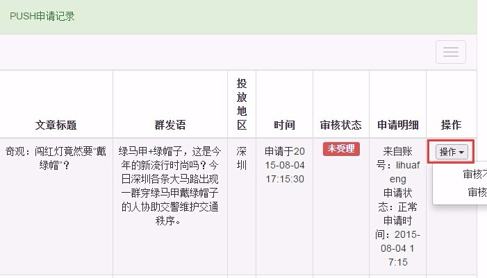

# push文章

## 创建
1. 选择一篇文章，点击文章操作中的 【>>】 展开所有选项，点击【push】。
2. 填入标题和群发语，当客户端收到push消息时会显示。由于各平台系统存在差异，可能只显示某一项，或者只显示一部分。

3. 标题**不得超过**15个汉字，群发语**不得超过**55个汉字，当剩余字节为负数时无法提交。

## 修改
 push消息创建完毕后并不会立即推送出去，而是处于待审核状态，可进入左边菜单【内容管理】模块下的【push记录】进行查看和修改：

   
- 在push消息未审核之前（即审核状态是**未受理**），可以点击【操作】中的【修改申请】进行修改。
- 在push消息未审核之前，点击【操作】中的【终止申请】可以终止申请。

## 审核
1. push消息需要经过审核才会进行推送，push消息创建和审核是两个不同的权限，由管理员分配：
2. 点击左边菜单【内容管理】模块下的【push管理】：

    - push审核窗口中显示的是已提交的push申请记录；
    - 执行【审核不通过】操作，此push申请记录将被锁定，不会推送给客户端，申请push的人也不能再修改此消息；
    - 执行【审核通过】操作，此push申请记录将被锁定，同时推送给客户端，申请push的人也不能再修改此消息。
        
> - 理论上，审核通过后消息是立即被推送出去的，但如果多条push消息在差不多的时间执行推送的话，有可能引发异常，影响push效果，通常情况下，**两条push最少间隔30分钟**。
> - 地区组织的账号已经绑定推送范围为所在地区，如果有影响全国的重要消息，可以同步给ZAKER编辑，在全平台进行push。