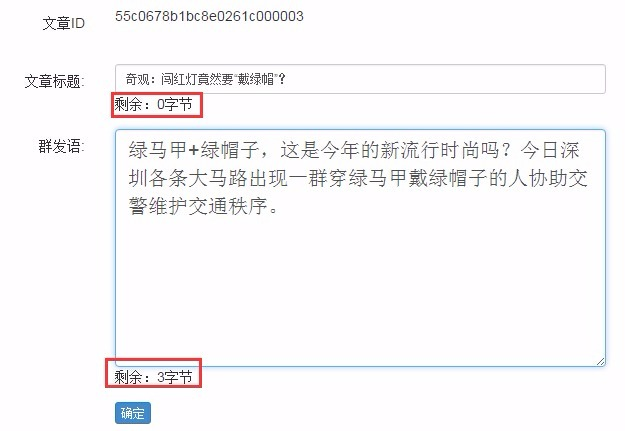
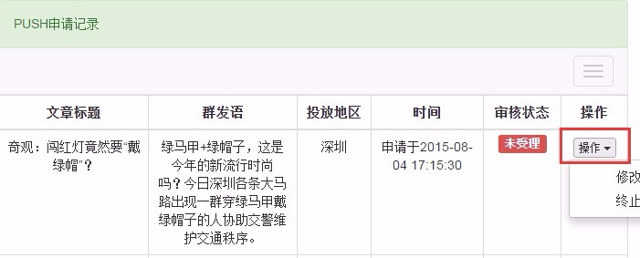
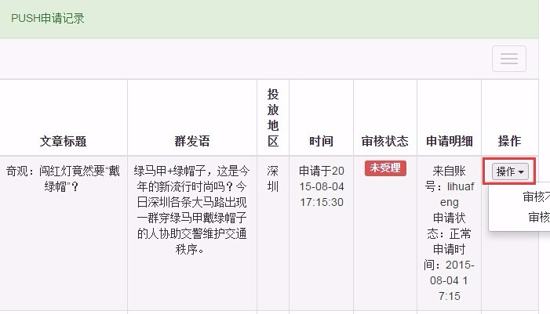

# Push文章

Push是指将文章强制推送到客户端（前提是用户在安装和设置中允许app进行这种推送），会在设备的通知中心中显示。

Push是强力的推广和激活用户的手段，但是不能无节制地使用，在统计到的卸载原因统计中，推送过多是排在第一位的，所以Push是双刃剑，请做好质量和频率的把控。

1. 创建Push消息
    - 选择要推送的文章，点击文章操作中的**Push**，弹出创建Push消息窗口：

        - 分别填入标题和群发语，当客户端收到Push消息时，会出现在消息通知中（根据平台和版本不同，可能只显示某一项，或者只显示一部分）；
    
        - 标题的长度限制为15个汉字（30字节），群发语长度限制为55个汉字（110字节），当剩余字节为负数时，无法提交；
    
        - 根据目前设置，从总编到编辑都有创建Push消息的权限；
    
    - Push消息创建完毕后，并不会立即推送出去，而是处于待审核状态，可进入左边菜单**内容管理**模块下的**Push记录**进行查看和修改：

        - Push记录显示的是当前账户所提交的Push申请记录，其他账户提交的不能查看；
        
        - 在Push消息未审核之前（即审核状态是**未受理**），可以对Push消息进行修改，点击**操作**中的**修改申请**即可（缩小窗口后操作下拉菜单被隐藏了一部分，请无视，下同）；
        
        - 在Push消息未审核之前，可以终止Push消息审核申请，点击**操作**中的**终止申请**即可。

2. 审核Push消息

    - Push消息创建完毕后，需要经过审核，才会真正的推送到客户端，目前只有主编以上级别配置了审核权限；
    
    - 点击左边菜单**内容管理**模块下的**Push审核**进行审核：

        - Push审核窗口中显示的是所有账户提交的Push申请记录；
        
        - 执行**审核不通过**操作，此Push申请记录将被锁定，不会推送给客户端，申请Push的人也无法再修改此消息；
        
        - 执行**审核通过**操作，此Push申请记录也将被锁定，同时推送给客户端，申请Push的人同样无法再修改此消息；
        
3. 理论上审核通过后，消息是立即被推送出去的，但如果多条Push消息在差不多的时间执行推送的话，有可能引起高并发异常，所以尽量在Push前和ZAKER同事进行沟通，避免发生“撞车”；
    
4. 深圳ZAKER媒体后台已经绑定推送范围为深圳地区，如果有影响全国的重要消息，可以和ZAKER同事沟通，在全平台进行Push。