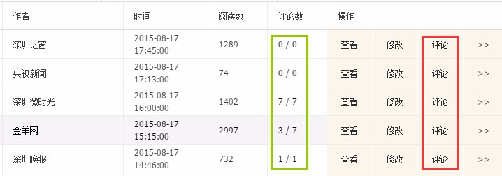
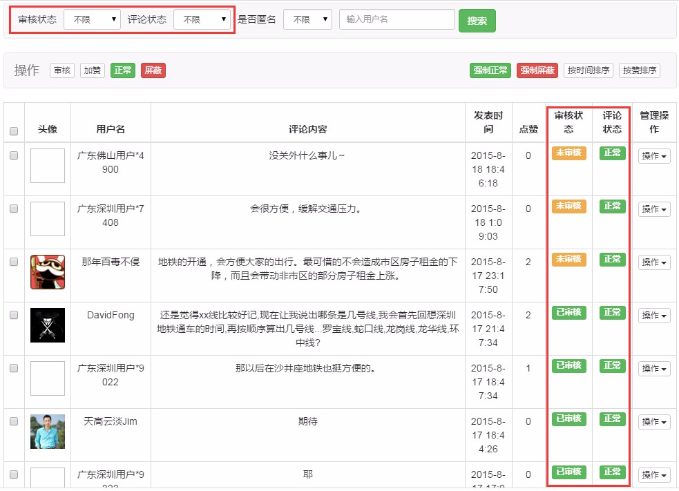
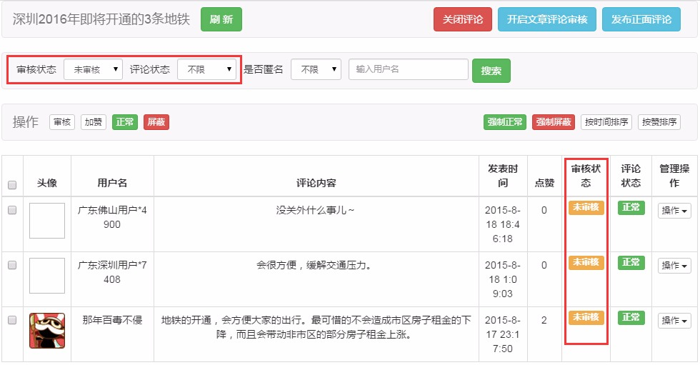
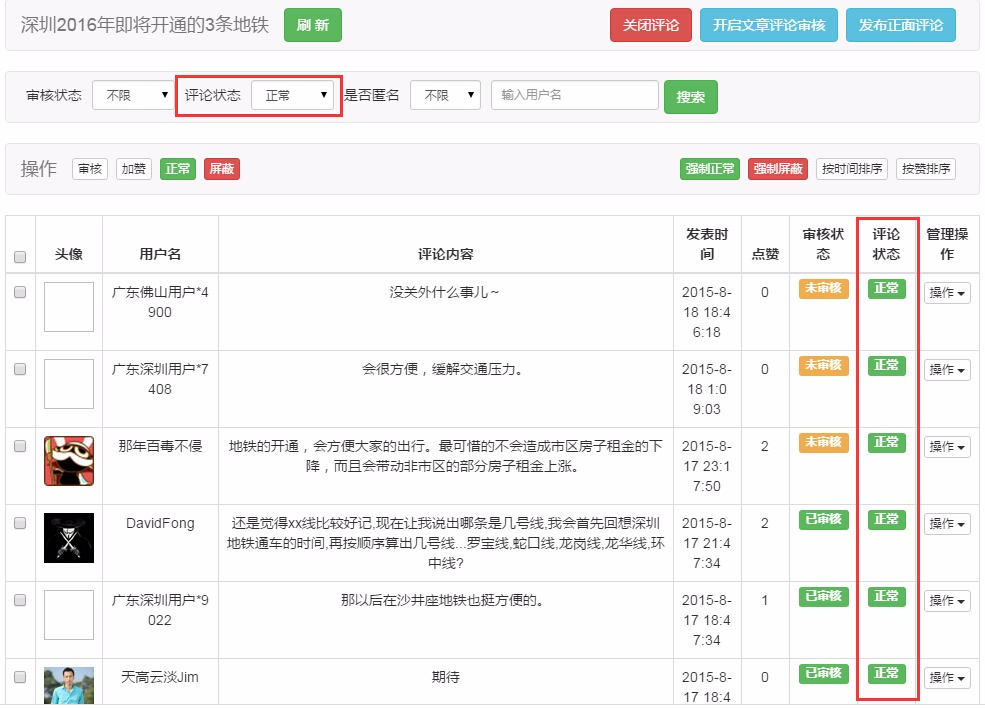

# 评论管理入口

要对文章评论进行管理，共有3个操作入口：

1. 第1个入口为频道文章列表“操作”中的**评论**选项，点击后将打开评论管理页面，此时显示该文章的所有评论，无论审核状态和评论状态是什么。

2. 第2、3个入口是文章列表“评论数”中的两个数字：

    - 第一个数字指的是该文章未经审核的评论数，点击该数字也将打开评论管理页面，并筛选出审核状态为“未审核”的评论；
    

    - 第二个数字指的是该文章已显示在客户端上的评论数，也就是用户能看到的评论数，点击该数字也将打开评论管理页面，并筛选出评论状态为“正常”的评论；
    
         

