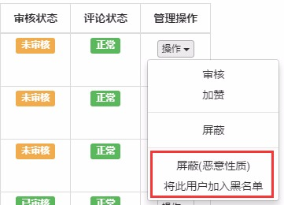

# 评论管理操作

评论管理页面在结构上分为4个部分，从上到下分别为“标题栏+全局操作、“筛选工具栏”、“评论批量操作+排序工具栏”和“评论列表”：

1. **标题栏+全局操作**


    - 左侧显示文章标题；
    - **刷新**可刷新整个页面； 
    - **关闭评论**是循环开关，在“关闭评论”和“开启评论”间切换，可设置文章是否允许用户评论；  
    - **开启文章评论待审核**是循环开关，在“开启文章评论待审核”和“停止文章评论待审核”间切换，开启后用户仍旧可以评论，但暂时不会显示在客户端，需等待人工审核；
    - 如上文所述，链接相同的文章其评论是打通的，考虑到评论安全管控的重要性，**开/关评论**和**开/关文章评论待审**这两个需要谨慎操作的功能暂时不开放，地区代理运营人员对评论管理规范有足够了解后可申请配置权限，当前阶段如果有需要进行这两个操作，请联系ZAKER编辑；
    - **发布正面评论**用于政治文章和广告文章，这两类文章需要人为地创造一种较“和谐”的评论氛围，可基于预先配置的评论库进行自动填充。

2. **筛选工具栏**


    - 审核状态可选“未审核”、“已审核”和“不限”；
    - 评论状态可选“正常”、“屏蔽”、“待审核”和“不限”；
    - 是否匿名可选“正常”、“匿名”和“不限”；
    - 输入用户名可按用户名进行筛选；
    - 以上4个选项可叠加，如上图是筛选出“**所有匿名用户发表的未经审核但已被屏蔽的评论**”（例如评论中包含敏感词被系统自动屏蔽了）。

3. **评论批量操作+排序工具栏**


    - **审核**
        - 通俗点讲就是“已阅”的意思，可将评论的“审核状态”改为“已审核”，不会改变“评论状态”，即编辑认可当前的评论状态，不管它是“正常”、“屏蔽（中了敏感词被自动屏蔽）”或是“待审核”；
        - 审核操作只对“审核状态”为“未审核”的评论有效。
    - **加赞**，客户端设有热评区，会把赞数最多的5条置顶 ，通过手动加赞，可以控制热评区出现哪几条评论。
    - **正常**
        - 把“评论状态”设为正常，客户端显示该评论；
        - “正常”只对“审核状态”为“未审核”的评论有效，执行操作后将会变成“已审核”。
    - **屏蔽**
        - 把“评论状态”设为屏蔽，客户端不显示该评论；
        - “屏蔽”只对“审核状态”为“未审核”的评论有效，执行操作后将会变成“已审核”。    
    - **强制正常**
        - 错手屏蔽了评论时可使用此功能纠正；          
        - “评论状态”会被设为正常，客户端显示该评论；  
        - “强制正常”只对“审核状态”为“已审核”的评论有效。
    - **强制屏蔽**
        - 错手放出了评论时可使用此功能纠正；
        - “评论状态”会被设为屏蔽，客户端不显示该评论；
        - “强制屏蔽”只对“审核状态”为“已审核”的评论有效。 
        
    > 通常情况下，使用加赞、审核、正常、屏蔽这4个功能就足够了，两个强制性的操作只是用于弥补错误，所以故意放到右边，请勿当作常规功能来使用，这样其实是放松了对操作准确性的要求。

    - **按时间排序**和**按赞排序**，如字面意思，改变下方评论列表的排序。

4. **评论列表**，列出筛选出来的评论，显示用户信息，评论内容以及相关状态等，另外也包括针对单条评论的操作，其中有2项是批量操作中没有的：

    - **屏蔽（恶意性质）**
        - 相对普通屏蔽的区别是，此功能在屏蔽该条评论之余，还会记录为不良评论，当某个用户的不良评论达到```12```条时会被禁言```2```天；
        - 大部分用户在被屏蔽一次后，就知道不应该再发违规评论，所以**屏蔽（恶意性质）**适用于有再次“作案”倾向的用户，请注意区分，此功能属于更高一级的警告，请勿随意使用。
    - **将此用户加入黑名单**
        - 永久性拉黑，除非人工解除；
        - 只适用于屡教不改，多次挑战评论底线，想方设法钻敏感词库漏洞的人，请勿随意使用。