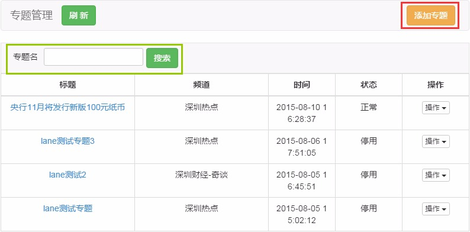
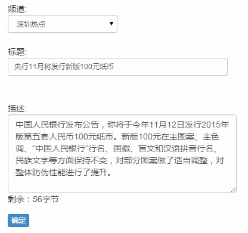
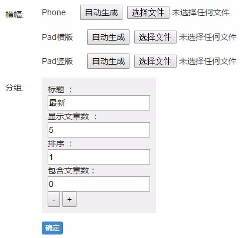
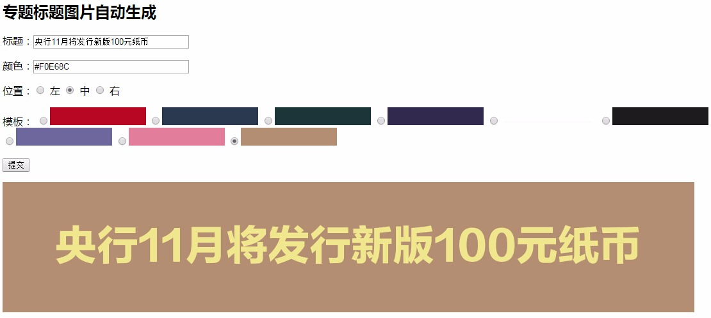
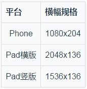
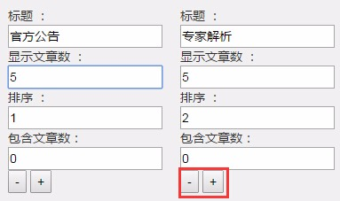
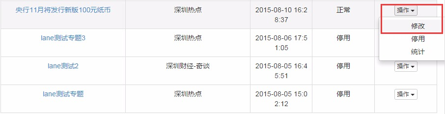

# 新建专题

1. **专题管理**功能在左侧菜单的**内容管理**模块下，点击后打开专题列表页面：


    - 下方列出已存在的专题，可按专题名进行搜索；
    - 点击右上角**添加专题**可新建专题。

2. 新建专题时可填入频道、标题、描述这3项信息：


    - **频道**
        - 每个专题需要绑定一个频道，建立一个1对1的关系；
        - 绑定频道后并不代表专题只在某个频道能看到，也不代表专题内只能有某个频道的文章。
    - **标题**
        - 标题是指专题在后台记录的标题，并不影响客户端；
        - 此标题可用于搜索专题。
    - **描述**
        - 可选项，可以不填；
        - 字数上限为280字节，等于140个汉字，超出后无法提交。

3. 正确提交后新专辑即被创建，此时窗口下方会多出横幅和分组这两项：


    - 横幅根据平台不同，需上传3张不同规格的图片，后台预设了几套简单的模板， 点击**自动生成**，在打开的页面中可以快速生成专题横幅：
    

        - **标题**：横幅上显示的文字，通常与专题名一致；
        - **颜色**：横幅文字的字体颜色，默认留空时为白色，如需改变请填入16进制颜色代码，如上图金黄色为```#F0E68C```；
        - **位置**：横幅文字的摆放位置，默认留空时为居中；
        - **模板**：横幅的背景，请选择其中一种； 
        - 提交后会在下方生成横幅图片，请“右键另存为”将其保存到电脑上；  
        - 三种规格横幅的自动生成操作是一样的。
    - 重要专题可由设计专门制作，规格如下：<br>
    

    - 准备好三张横幅图片后，点击**选择文件**将他们上传到对应的平台上，确认提交即可生效，如果要更换则再次上传。
    - 分组即专题文章列表的分组，可将文章归入不同的组别，增加内容层次感：
    

        - **标题**：分组的名称，后台和客户端上都会显示；
        - **显示文章数**：该分组默认显示几篇文章，超出的在客户端上会折叠起来； 
        - **排序**：分组的排序，排序为1时该分组排在第一位，其余类推；
        - **包含文章数**：该分组目前包含的文章数量，系统自动计算，不需要人工修改；
        - **-和+**：分别是删除分组和增加分组。

4. 以上6项全部设置完后，一个完整的专题就搭好了框架，如果要修改，可以使用专题列表页面点击**操作**中的**修改**选项：

