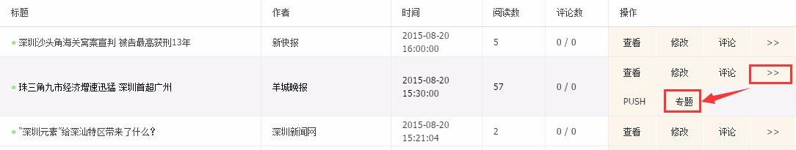
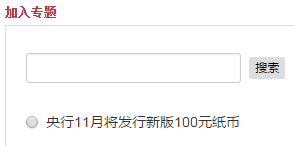
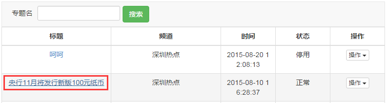
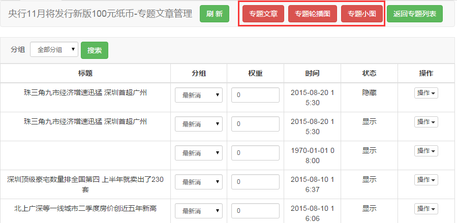
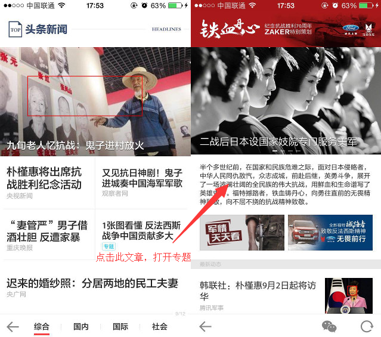

# 专题文章

1. **文章推入专题**
    - 在频道中找到要推入专题的文章，点击**操作**中的**>>**展开隐藏选项，再点击**专题**；
    

    - 弹出的窗口中会列出所有已启用的专题，专题较多时可使用搜索，点击某个专题即可将文章推入。
    

2. **专题文章管理**

在专题列表页面点击标题即可进入专题进行内容管理，可管理的内容包括专题文章、专题轮播图和专题小图，默认显示专题文章，点击右上角的选项可切换：

- **分组**：文章所属的分组，推入时默认归入第1个分组，可更改；
- **权重**：决定文章在分组中的排序，权重高的排在前面；
- **状态**：有“显示”和“隐藏”两种值;
- **操作-评论管理**：管理该文章的评论；
- **操作-修改文章**：修改该文章的内容；
- **操作-显示于专题/不显示于专题**：控制该文章是否在专题中显示，和**状态**相对应；
- **设置入口/取消入口**：文章被设为专题“入口”时，在频道点击该文章时会跳转专题。
