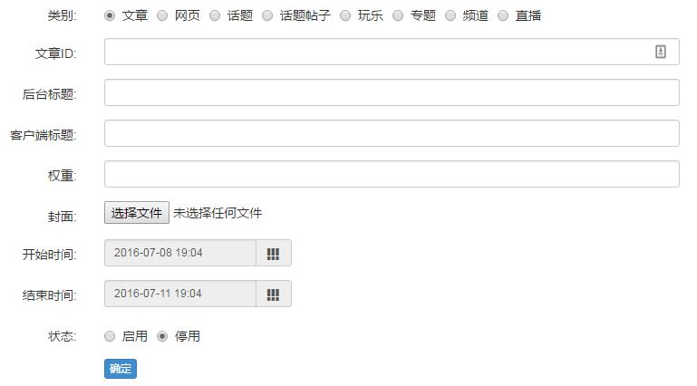

# 专题轮播图

## 一、轮播图列表
和专题文章类似，页面中间是轮播图列表，列出已有的轮播图、相关信息及操作。

## 二、添加轮播图
点击右上角【添加轮播图】可以新增轮播图，支持打开 8 种类型的内容。

- **类别**：即内容类型的，要打开文章就选【文章】，要打开网页就选【网页】
> **注意**：[文章跳转](chapter09.html)在专题里并不会生效（实际上，只在频道内有效），即一篇文章设置了跳转网页，再放到轮播图，打开时是打开文章本身，不会跳转网页，其他同理。
- **参数**：根据所选择的**类别**，这个选项会相应改变，比如类型是“文章”时，参数是“文章ID”，类型是“网页”时， 参数是“网页地址”；
- **后台标题**：后台显示的标题，方便运营人员区分各个轮播图；
- **客户端标题**：客户端显示的标题，即用户实际看到的标题；
> 客户端标题可以为空，通常这样使用的时候是因为轮播图的图片上已经包含了标题，此时不重复显示标题更为美观；
- **权重**：决定轮播图的排序，权重高的排在前面；
- **封面**：轮播图显示的图片；
- **开始/结束时间**：决定轮播图的有效时间范围，范围以外的时间用户看不到（前提是轮播图已启用）；
- **状态**：只有启用的轮播图才可能出现在客户端。