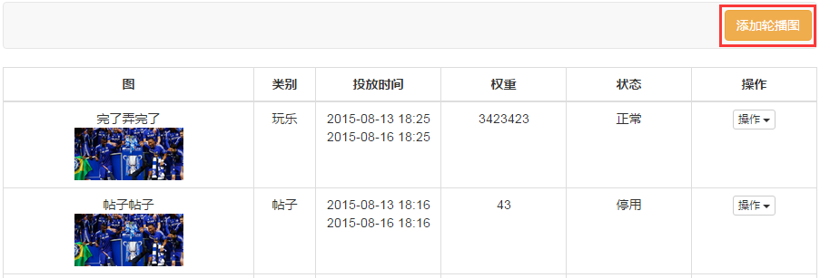
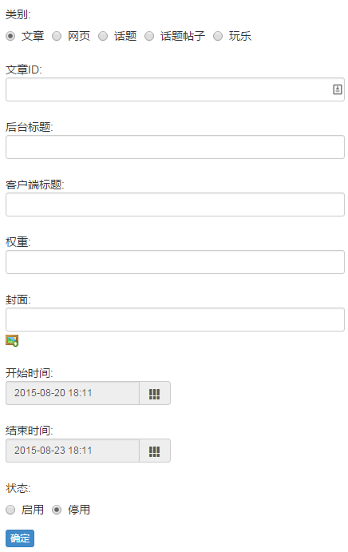

# 专题轮播图

和专题文章类似，页面中间是轮播图列表，列出已有的轮播图、相关信息及操作，点击右上角选项可**添加轮播图**：

- **类别**：支持跳转5种类型；（**注意**：文章如果设置了[跳转](chapter09.html)，在专题里并不会生效。）
- **文章ID**：根据所选择的**类别**，这个选项会改变；
- **后台标题**：后台显示的标题，即运营人员看到的标题；
- **客户端标题**：客户端显示的标题，即用户看到的标题；
- **权重**：决定轮播图的排序，权重高的排在前面；
- **封面**：轮播图显示的图片；
- **开始/结束时间**：决定轮播图的有效时间范围，范围以外的时间用户看不到（前提是轮播图已启用）；
- **状态**：决定用户是否看得到。