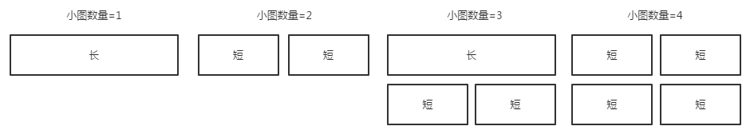
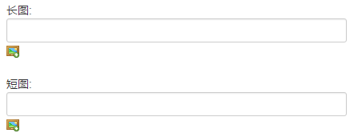

# 专题小图
小题和轮播图基本相同，只是在呈现样式和交互上有所不同，在一个专题内，小图的数量最少0个，最多4个：

- 根据数量不同，小图会显示出不同的排列布局；

- 不同布局下 ，小图的规格会变化，所以需要上传长图（1240x240）和短图（594x240）两张图片；

- 如果可以确定小图数量不会改变（比如ZAKER每天的固定专题只上2个小图），可以只上传对应规格的图，不需要长短图都传。