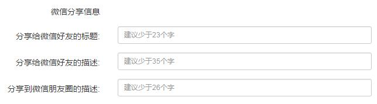
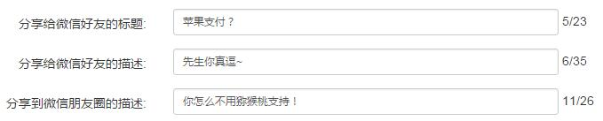

# 专题分享文案
专题目前支持分享给微信好友或分享到微信朋友圈，新版客户端支持自定义分享文案，共3项：

- 分享给微信好友的标题，如上图中的“Apple Pay上线，一大波优惠来袭！”。
- 分享给微信好友的描述，如上图中的“轻轻一碰秒速买买买！19家银行支持Apple Pay”。

- 分享到微信朋友圈的描述，如上图。

----

1. 点击左侧菜单【专题管理】，进入专题列表页面，点击某个专题【操作】中的【修改】，页面最下方为 **“微信分享信息”**选项：
    

    - 3项信息默认为空，也允许不填任何一项，为空时系统会使用专题标题、描述、文章标题等进行自动填充。
    - 如果人工填了，就以自定义的信息为准。
    - 由于微信分享样式是固定的（非ZAKER控制），如果想在主流设备屏幕上完整显示，建议不超过上图提示的字数范围（非强制，可超过）。

2. 输入时，会实时显示已输入的字数和建议的字数上限：
    

3. 自定义文案后，如果不需要，可重新修改将其删除，只要某一项为空，系统仍会在输出时自动填充。

4. 修改文案后，需要刷新专题，携带的分享信息才会更新。

5. 分享信息只是保存在ZAKER专题内，当用户发起微信分享时将其传递过去，用于在微信上生成消息，因此：
    - **修改文案对已经分享到微信上的消息不起作用**
    - **真的不起作用**（认真脸
    - **泼出去的水是收不回来的**
    - **微信上的东西我们也是动不了的**