# 专题管理

1. 专题结构：完整的专题包括横幅、轮播图、描述、小图、分组和文章6个组件，实际效果如下图：
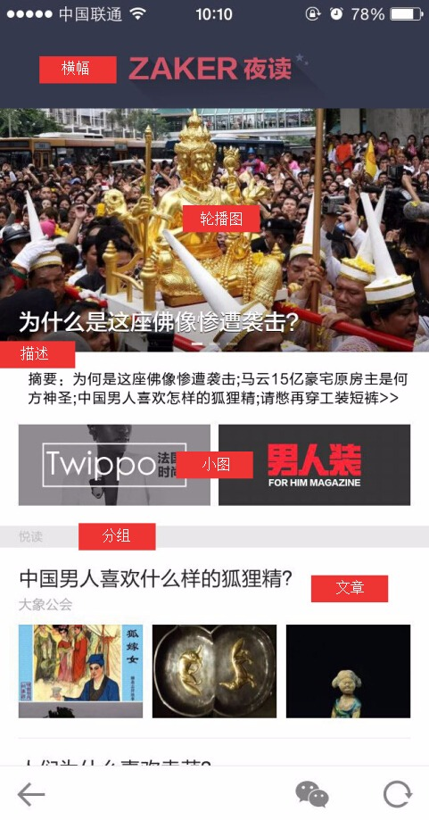

 - 横幅必选，否则是空白；
 
 - 轮播图可选，可跳转文章、网页、话题、话题帖子和玩乐5种类型；
 
 - 描述可选，对专题的介绍或者亮点概括，可用作导读、摘要等；
 
 - 小图可选，最多显示4个，通常用1-2个，可跳转的类型和轮播图一样；
 
 - 分组必选，至少一个；
 
 - 文章可选，也就是专题里没有一篇文章都可以，但是通常有8-10篇文章才会搭建专题。

2. 新建专题
 - **专题管理**功能在左侧菜单的**内容管理**模块下，点击后打开专题列表页面：
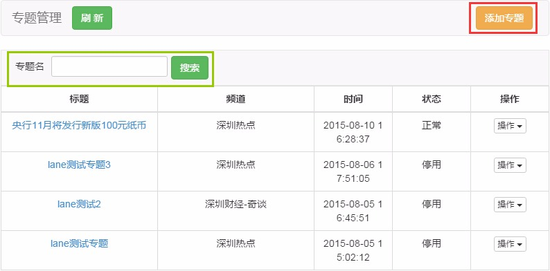

    - 下方列出已存在的专题，可按专题名进行搜索；
 
    - 点击右上角**添加专题**可新建专题。

 - 新建专题时可填入频道、标题、描述这3项信息：
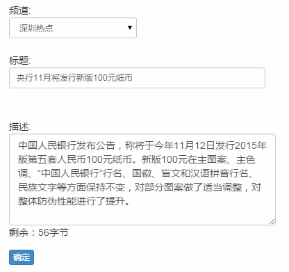

     - **频道**
         - 每个专题需要绑定一个频道，建立一个1对1的关系。
         
         - 绑定频道后并不代表专题只在某个频道能看到，也不代表专题内只能有某个频道的文章；

     - **标题**
         -  标题是指专题在后台记录的标题，并不影响客户端；
        
         -  此标题可用于搜索专题；

     - **描述**
         - 可选项，可以不填；
         
         - 字数上限为280字节，等于140个汉字，超出后无法提交。

 - 正确提交后新专辑即被创建，此时窗口下方会多出横幅和分组这两项：
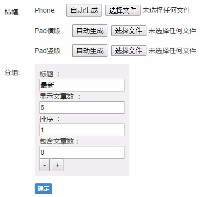

 - 横幅根据平台不同，需上传3张不同规格的图片。
    - 后台预设了几套简单的模板， 点击**自动生成**，在打开的页面中可以快速生成专题横幅：
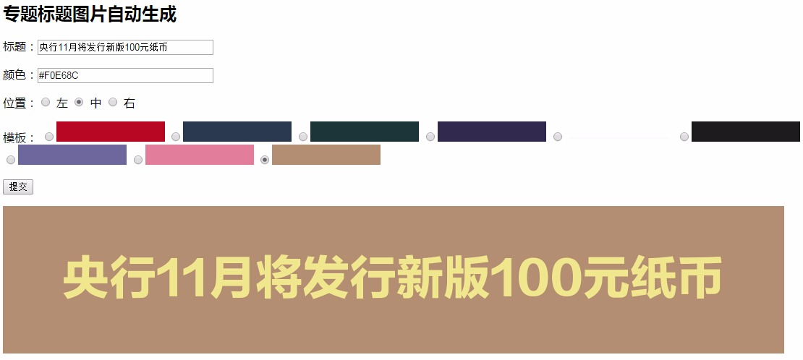

        - **标题**：横幅上显示的文字，通常与专题名一致；
         
        - **颜色**：横幅文字的字体颜色，默认留空时为白色，如需改变请填入16进制颜色代码，如上图金黄色为```#F0E68C```；
         
        - **位置**：横幅文字的摆放位置，默认留空时为居中；
         
        - **模板**：横幅的背景，请选择其中一种；
         
        - 提交后会在下方生成横幅图片，请“右键另存为”将其保存到电脑上；
         
        - 三种规格横幅的自动生成操作是一样的。

    - 重要专题可由设计专门制作，规格如下：<br>
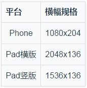

    - 准备好三张横幅图片后，点击**选择文件**将他们上传到对应的平台上，确认提交即可生效，如果要更换则再次上传。

 - 分组即专题文章列表的分组，可将文章归入不同的组别，增加内容层次感：
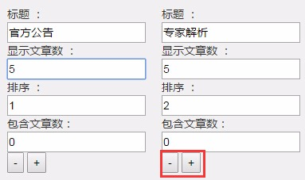

    - **标题**：分组的名称，后台和客户端上都会显示；
     
    - **显示文章数**：该分组默认显示几篇文章，超出的在客户端上会折叠起来；
     
    - **排序**：分组的排序，排序为1时该分组排在第一位，其余类推；
     
    - **包含文章数**：该分组目前包含的文章数量，系统自动计算，不需要人工修改；
    
    - **-和+**：分别是删除分组和增加分组。

 - 以上6项全部设置完后，一个完整的专题就搭好了框架，如果要修改，可以使用专题列表页面点击**操作**中的**修改**选项：
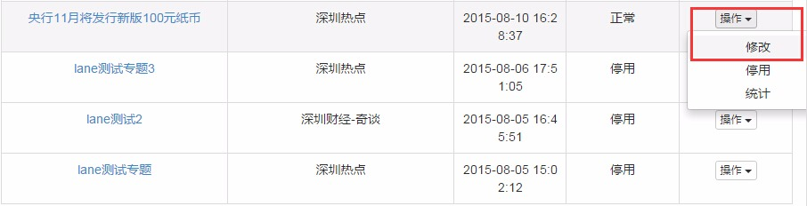

3. 将文章推入专题

 - 在频道中找到要推入专题的文章，点击**操作**中的**>>**展开隐藏选项，再点击**专题**；
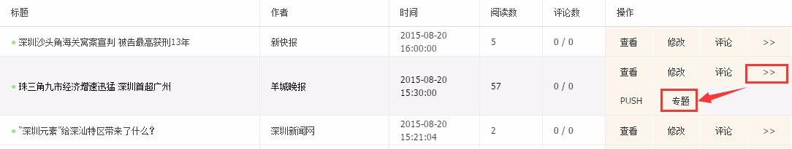

 - 弹出的窗口中会列出所有已启用的专题，专题较多时可使用搜索，点击某个专题即可将文章推入。
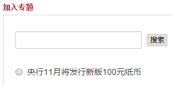

4. 管理专题文章
 - 在专题列表页面，点击专题的标题即可进入专题进行内容管理；
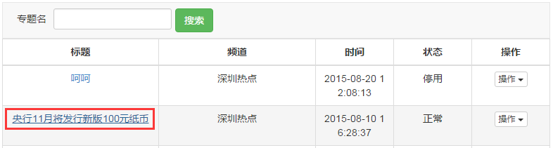

 - 专题内容包括专题文章、专题轮播图和专题小图，默认显示专题文章，点击右上角的选项可切换；
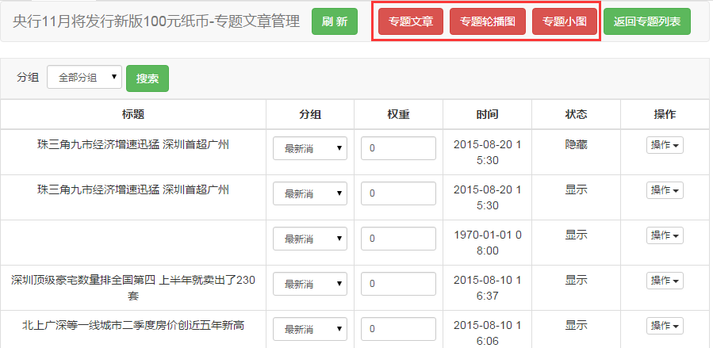

 - 专题文章管理页面的主要部分是文章列表：
     -  **分组**：文章所属的分组，推入时默认归入第1个分组，可更改；
     
     -  **权重**：决定文章在分组中的排序，权重高的排在前面；
     
     -  **状态**：有“显示”和“隐藏”两种值;
     
     -  **操作-评论管理**：管理该文章的评论；
     
     -  **操作-修改文章**：修改该文章的内容；
     
     -  **操作-显示于专题/不显示于专题**：控制该文章是否在专题中显示，和**状态**相对应；
     -  **设置入口/取消入口**：文章被设为专题“入口”时，在频道点击该文章时会跳转专题，如下图：


5. 管理专题轮播图
和专题文章类似，页面主题是轮播图列表，列出已有的轮播图、相关信息及操作；
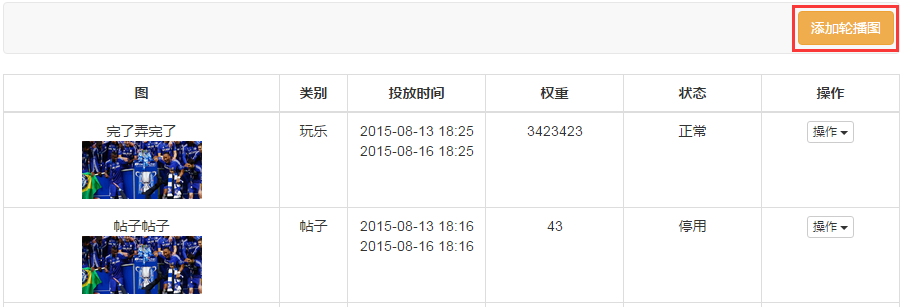

 - 点击右上角选项**添加轮播图**：<br>
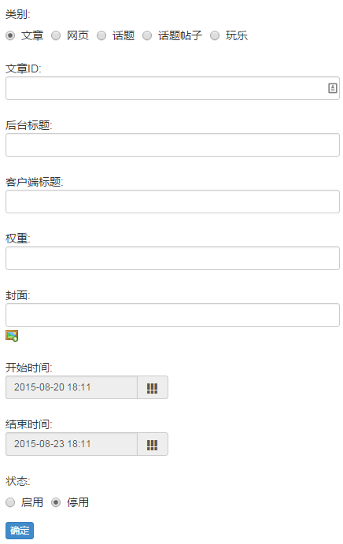

     - **类别**：支持跳转5种类型；
     
     - **文章ID**：根据所选择的**类别**，这个选项会改变；
     
     - **后台标题**：后台显示的标题，即运营人员看到的标题；
     
     - **客户端标题**：客户端显示的标题，即用户看到的标题；
     
     - **权重**：决定轮播图的排序，权重高的排在前面；
     
     - **封面**：轮播图显示的图片；
     
     - **开始/结束时间**：决定轮播图的有效时间范围，范围以外的时间用户看不到（前提是轮播图已启用）；
     
     - **状态**：决定用户是否看得到；

6. 管理专题小图
小题和轮播图基本相同，只是在呈现样式和交互上有所不同：
 - 在一个专题内，小图的数量最少0个，最多4个；
 
 - 根据数量不同，小图会显示出不同的排列布局，如下图：
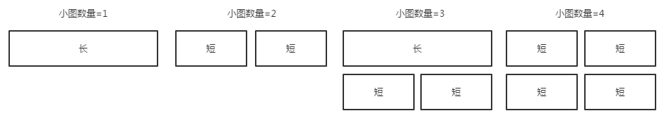

 - 不同布局下 ，小图的规格会变化，所以需要上传长图（1240x240）和短图（594x240）两张图片；<br>
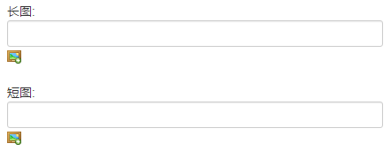

 - 如果可以确定小图数量不会改变（比如ZAKER每天的固定专题只上2个小图），可以只上传对应规格的图，不需要长短图都传；

7. 设置专题入口
 - 专题是否有入口，决定了用户能否看到专题；
 
 - 没有设置入口的专题，即使是启用状态，用户也是没有途径能进入的；
 
 - 第4步中已介绍了设置方法，但设置入口通常是最后1步，等专题搭建和填充内容完成后才进行；
 
 - 一个专题可以有多个入口；
 
 - 通常来说，设置为入口的文章也应该放在专题内最显眼的位置，否则用户会有被标题忽悠进来的感觉。

