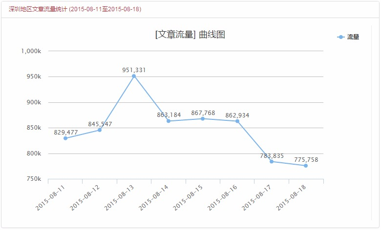
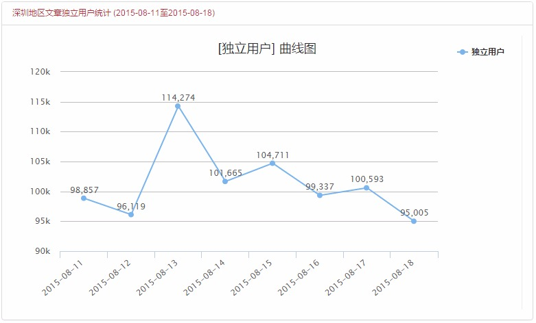
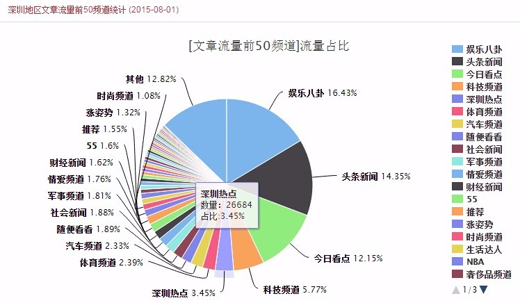
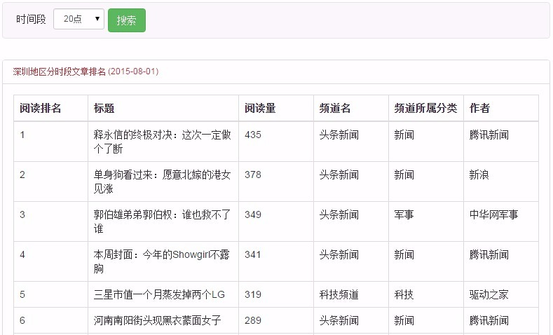
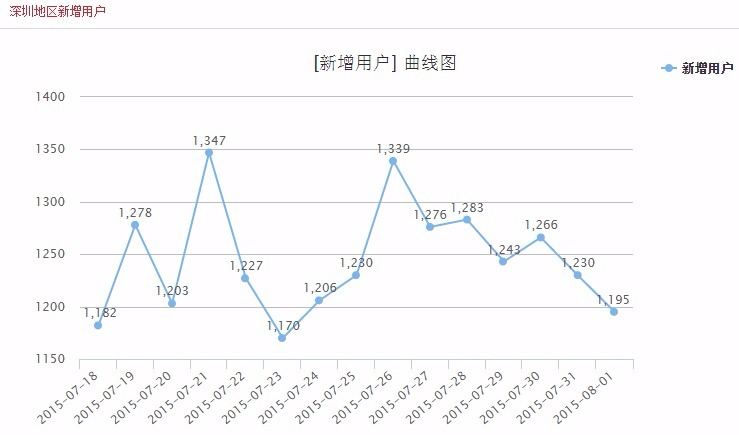

# 数据统计

登录成功后默认进入后台首页，目前此页面展示深圳地区用户（指整个平台内所有深圳用户，并不限制为订阅了深圳相关频道的用户）的一些阅读统计数据：

1. 第一、二个图表分别展示深圳地区的文章流量（即阅读数，或称PV）和独立用户数（或称UV）走势：

 * 默认选择的时间范围是过去一周；
 
 * 可在顶部的时间选择器中调整范围，点击**刷新**更新数据；
 
 * 此选择器是整个页面共用的，改变范围后所有图表都会跟着变化。

2. 第三个图表展示深圳地区流量占比中排在前50的频道：

 * 默认选择的时间为昨天；
 
 * 频道流量占比这个图表显示哪天的数据，取决于顶部时间选择器选定的结束时间，下同。

3. 第四个图表展示深圳地区一天中各个时段点击量排名前50的文章：

 * 默认时间段为昨天的同一时段，比如当前是20点，这里就列出昨天20点这个时间段里击量最高的文章，作为同期参考；
 
 * 列表中的阅读量就是那个时段中各篇文章所获得的点击量；
 
 * 除标题和阅读量外，也展示了文章所属的频道以及频道所属的分类等信息，可以观察用户在各时间段的喜好。

4. 第五个图表展示深圳地区每天新增的用户数， 默认选择的时间范围是过去两周。

