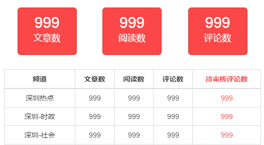
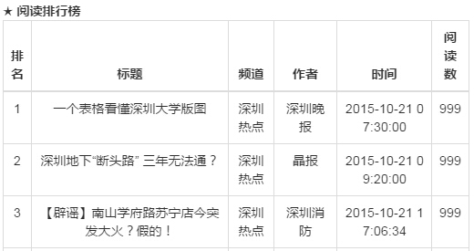

# 实时监控
> 本节排在前面主要考虑到登录后便进入首页，先进行介绍比较符合实际使用情况，如果出现暂时不能理解的概念和名词，可以先跳过，后续章节会解释。

登录成功后进入后台首页，展示**当天**（从0点到现在）的文章实时数据，每10分钟刷新一次。

1. 第一部分显示本组织所管理的每个频道的文章数据以及所有频道的汇总数据。

    - 文章数：已发布的文章篇数，文章状态为“正常”或“置顶”，即用户能看到的；
    - 阅读数：文章的点击数量；
    - 评论数：文章的评论数量，评论状态为“正常”，即用户能看到的；
    - 待审核评论数：等待审核的评论数量，提醒有多少评论等待编辑审核。

2. 第二部分为数据排行榜，分为阅读排行榜和评论排行榜，显示前10 名。

    - 标题：文章的标题；
    - 频道：文章所属频道；
    - 作者：文章作者名；
    - 时间：文章的发布时间；
    - 阅读数 / 评论数：文章的点击数量 / 文章的评论数量。
