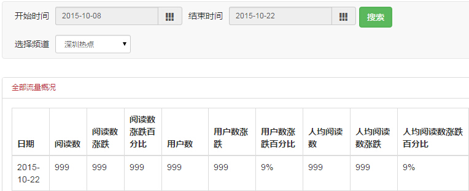
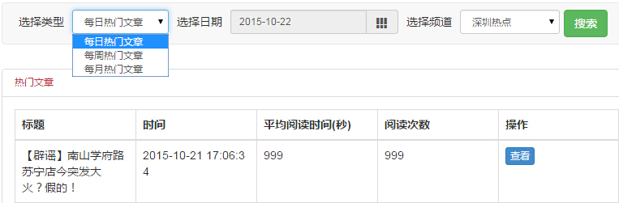
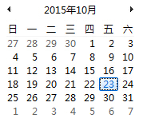
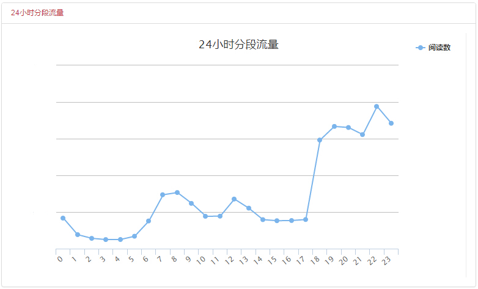
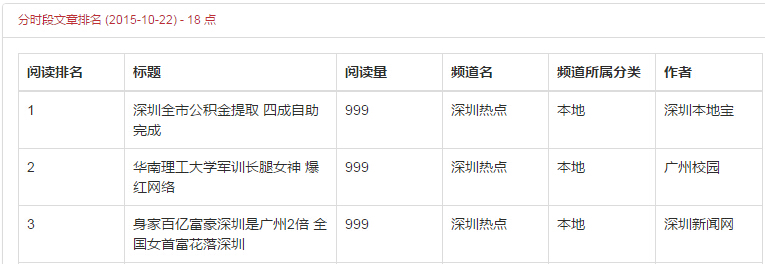

# 频道统计
> 频道统计项目包括整体统计、热门文章统计、时段统计和用户统计4项：

  - 默认显示整体统计；
  - 点击右上角按钮切换不同的统计项目；

1. **整体统计**

  - 默认显示最近两周的数据，可修改**开始时间**和**结束时间**调整统计范围。
  - 如果是管理多个频道的组织媒体，可在频道间切换。
  - 统计区分全部和内部，内部指ZAKER客户端，全部包含客户端和第三方渠道（如微信，微博等）；
  - 全部和内部的统计项目相同，包括：
    - 阅读数，阅读数涨跌（相比前一天的变化数值），阅读数涨跌百分比（相比前一天的变化幅度）；
    - 用户数，用户数涨跌，用户数涨跌百分比；
    - 人均阅读数数，人均阅读数数涨跌，人均阅读数数涨跌百分比。

2. **热门文章统计**

  - 可分别查询日、周、月的热门文章，显示平均阅读时间和阅读数；
  - 按选择的日期决定对应的日、周、月，如果选择日期为**2015-10-23**：
  

    - 每日热门对应前一天，即**2015-10-22**；
    - 每周热门对应前一周，即**2015-10-12~2015-10-18**；
    - 每月热门对应前一月，即**2015-09-01~2015-09-30**。

3. **时段统计**
  - 频道在一天24小时的阅读数变化曲线，默认时间为前一天。
  

  - 各个时间段的阅读top50排行榜，默认时间段和系统时间相同。
  

4. **用户统计**
  - 本月订阅用户平台分布数：订阅用户指订阅了该频道的用户，不一定会进入频道阅读；
  - 本月活跃用户平台分布数：活跃用户指阅读了该频道文章的用户，不一定订阅了频道；
  - 最近用户偏好：用户最近的关注焦点，关键词越大表示关注度越高。