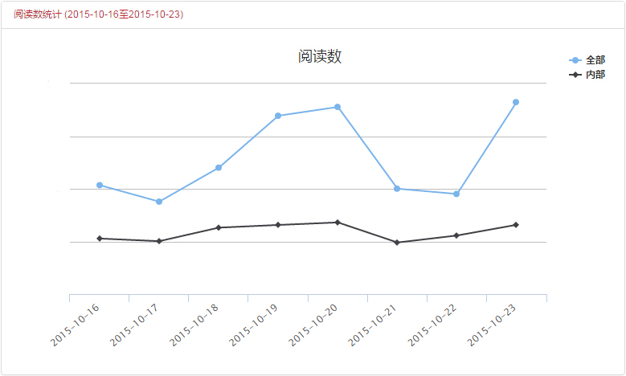

# 组织统计
> 管理多个频道的组织媒体，可以在组织统计中查看汇总数据，即此处看到的数据，是所有频道相加后得出的结果。

1. 统计项目包括阅读数、用户数和人均阅读数3项，区分全部和内部：

    - 阅读数直接相加，不存在重复；
    - 用户数先合并再相加，因为同一个用户会在多个频道阅读；
    - 人均阅读数等于阅读数除以用户数。

2. 默认的时间范围是最近一周，可手动调整。

