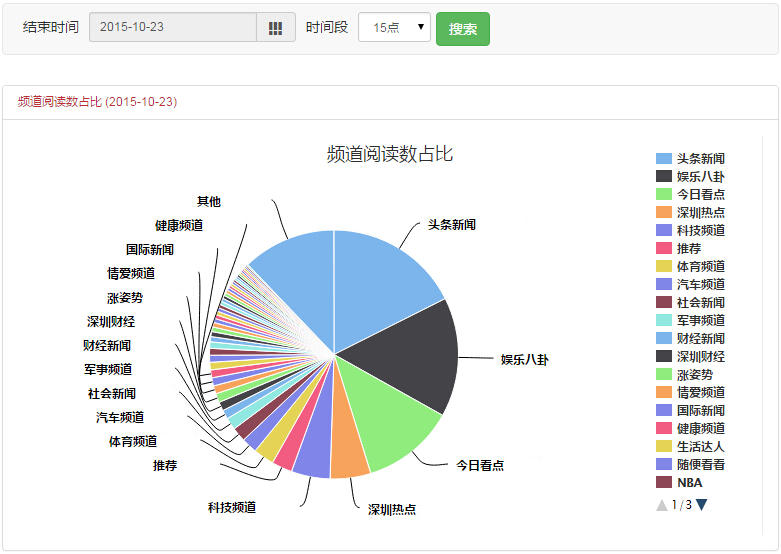

# 地区统计
> - 地区性的组织媒体（例如深圳晚报），可以查看所在地区的统计数据，统计对象是定位在所在地区的用户，例如深圳晚报可查看深圳地区用户的统计数据。
- 请注意统计的是该地区用户在ZAKER全平台的数据，而不是地区用户在地区媒体所管理频道内的数据，因为本地频道的受众基本都是当地用户，没有必要去统计；
- 包括整体统计、时段统计和用户统计3项，右上角可切换。

1. **整体统计**

    - 默认时间范围是最近一周，可手动调整；
    - 阅读数直接相加，不存在重复；
    - 用户数先合并再相加，因为同一个用户会在多个频道阅读；
    - 人均阅读数等于阅读数除以用户数；
    - 频道阅读数占比（饼图）：
    

        - 显示地区用户某一天的阅读数中各个频道的占比；
        - 默认时间是前一天，调整**结束时间**时会改变。

    - 频道阅读数占比（折线图）
    

        - 显示地区用户阅读数中各个频道占比的变化趋势；
        - 默认时间范围是最近一周，调整**开始时间**和**结束时间**时会改变。

2. **时段统计**
    - 频道阅读数占比（时段）
    

        - 显示该地区某一天某一时段的阅读数中各个频道的占比；
        - 默认时段与系统时间相同。

    - 文章阅读数排名
    

        - 显示该地区某一天某一时段的文章阅读排行榜top50；
        - 默认时间是前一天，调整**结束时间**时会改变。

3. **用户统计**

    - 显示最近两周内，该地区每天新增用户的数量，新增用户指新安装ZAKER的用户。
    - 时间范围不可调整。