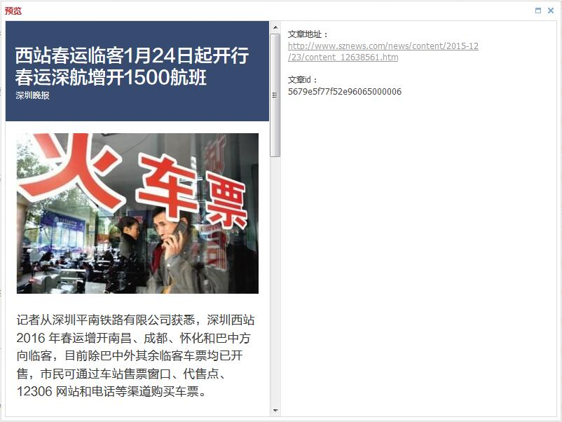

# 预览文章

> 预览功能是在后台提供一个近似客户端页面的**正文**预览效果：
> * 后台预览是通过网页去模拟一个相近的效果，仅供参考。
> * 提供的只有正文预览，频道预览暂时无法实现。

1. 点击操作中的“预览”（之前的名称是“查看”），弹出的预览页面分为两部分，左边为正文的预览，右边是文章的相关信息，包括文章地址和文章id。

2. 由于新的预览页面实现原理不同，之前“查看”中提供的“选择正文中图片为焦点图”的功能不能兼容，已经取消，可以使用[上传封面](chapter08.html)来完成这个操作。

