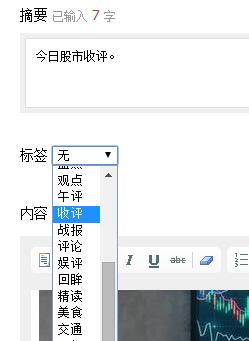
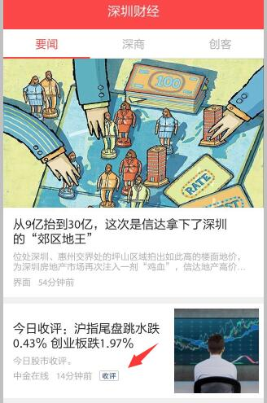

# 设置标签

> 这里的标签是指在频道的文章列表页面，跟着文章标题后的2-3个字的有色标签，可以突显部分重点文章。

1. 进入文章修改页面，在“摘要”下的“标签”一栏选择需要的标签，确认提交即可。

2. 客户端效果如下：

3. 注意
    - 标签的作用是吸引用户注意，以此突显重要的文章，不要每篇文章都加标签，或用标签来分类。
    - 标签都是专门设计的图片，不能自行添加，如果需要新的标签，请联系对接的ZAKER同事。