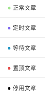
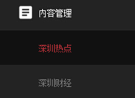
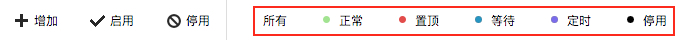

# 筛选文章

根据状态对频道内文章进行快速筛选，再进行针对性操作。

1. 文章状态，共5种：

  - 每篇文章的状态，会用相应颜色在文章标题左侧的小圆点上进行标识。
  - 正常和置顶（非定时置顶的情况下）为可见的状态，即用户只能看到这两个状态对应的文章。
  - 等待、定时和停用为不可见状态。其中，绑定到该频道的自动抓取文章为等待状态，等待编辑启用；设置了定时启用的文章为定时状态；被自动或手动停用的文章为停用状态。

2.操作入口，共2个：
  - 点击左侧菜单【内容管理】模块下的任意频道，右侧的频道管理页面默认筛选状态为**“正常”**或**“置顶”**的文章，既该频道对用户可见的文章总和。
  

  > **注意**：之前点击频道时，默认是不筛选文章，把该频道所有文章都罗列出来。

  - 点击频道管理页面顶部的状态按钮，即可筛选出对应状态的文章。
  