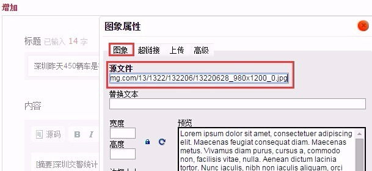
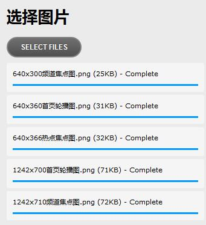

# 插入图片

### 插入网络图片
1. 空出一行作为图片插入的位置。
2. 在网页上直接复制图片，ctrl+v将其粘贴到编辑器中。某些情况下，复制-粘贴方法不起作用，请点击下图中的【图片】按钮，在弹出<图片属性>窗口中，将图片地址填入<源文件>一栏后提交。

###单张图片上传
1. 空出一行作为插入位置，点击【图片】按钮。
2. 点击切换到<上传>选项卡，点击【选择文件】然后选中本地图片，再点击【上传到服务器上】，提示上传成功后提交即可。

    > 上传的图片文件应小于800k，否则上传会失败，下同。 

### 批量图片上传
1. 空出一行作为图片插入的位置，点击【批量图片】按钮。

2. 在弹出窗口中点击【选择文件】，然后选择多张本地图片，确认后即开始上传，上传完毕的图片自动插入正文中。

    
