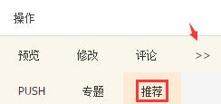
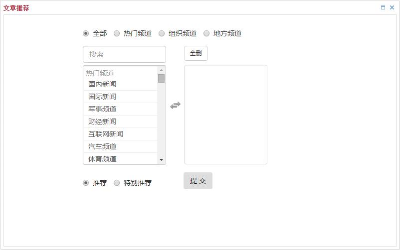

# 推荐文章

 如果有优质的原创文章，其内容影响不局限在本地之内时，可以将文章推荐到其他频道，包括ZAKER的自建频道和其他城市频道；另外，如果一篇文章想在所管理的几个频道中重复使用，也可以使用此功能。

## 一、操作入口
点击文章【操作】中的 ** >> **，在展开的菜单选项中选择【推荐】，弹出推荐文章设置窗口。

## 二、推荐设置

### 1. 推荐频道分类
- 热门频道：即ZAKER的自建频道，包括头条新闻、国内新闻、娱乐八卦、体育频道、财经新闻等。
- 组织频道：即本地媒体组织所管理的频道。
- 地方频道：主要的地方城市频道。
- 全部：默认选中，包含以上3个分类的所有频道。

### 2. 推荐频道选择
- 左侧为可选的推荐目标频道，和上面选择的分类相关，点击频道名即可设为目标频道，自动移动到右侧，再次点击可取消。
- 【搜索】即在当前可选的频道中进行搜索。
- 【全删】是清空所有已选择的目标频道。

### 3. 推荐类型选择

- **推荐**：表示常规性的推荐，提交后会出现在目标频道的“待启用”列表中，由对应频道的负责编辑决定是否使用。
- **特别推荐**：如果是独家猛料，具有全网影响力时可以设为特别推荐，提交后除了会出现在目标频道的“待启用”列表，还会出现数字提醒，对应频道的负责编辑可以第一时间看到。

> 注意：
> 1. 由于数字提醒非常醒目，会直接打断编辑的正常工作节奏，请谨慎评估稿件份量是否能设为“**特别推荐**”，否则会产生比较大的干扰。
> 2. 数字提醒只会出现在ZAKER的内部编辑后台，媒体后台不会出现。

### 4. 其他注意事项
- 未选择任何一个目标频道时，提交会报错。
- 目标频道已存在相同文章时，提交会报错。
