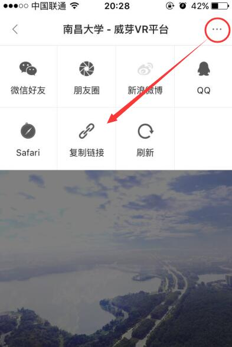
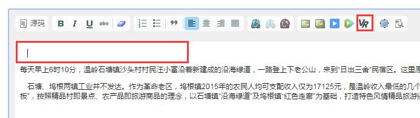
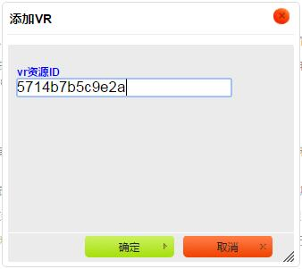

# 插入VR
- VR 是一种新的内容资源，可以根据用户的操作或重力感应进行视角切换，在交互体验上有较大的突破，应用在新闻资讯领域上可以极大增强现场感。
- ZAKER 已推出国内首个新闻 VR 平台“威芽”，生成的 VR 资源可插入到 ZAKER 上。

## 一、获取 VR 资源 ID
1. 利用 VR 设备拍摄素材，发布到“威芽”平台（具体操作参考此[文档](http://120.76.145.26/zkcms/vr102.pdf)）；
2. 发布成功后打开播放，点击右上角，选择【复制链接】：

3. 复制出来的链接会类似 **http://pic720.com/tour.php?pano_pk=5714b7b5c9e2a**，其中 **pano_pk=** 后的字符串 **5714b7b5c9e2a** 即为 VR 资源 ID 。

## 二、操作流程
1. 点击【增加】新建一篇文章，或点击【修改】编辑一篇文章，在编辑器中空出一行用于插入VR：

2. 点击上图中的【插入VR】按钮，弹出设置窗口，填入第一步获取的 VR 资源 ID，确认后提交即可完成插入，无需其他操作。
