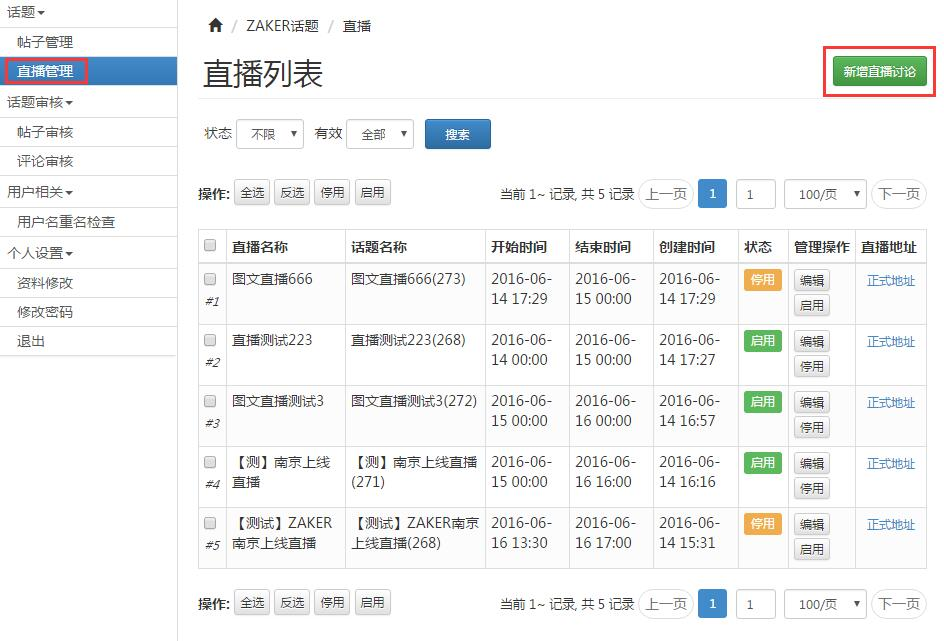
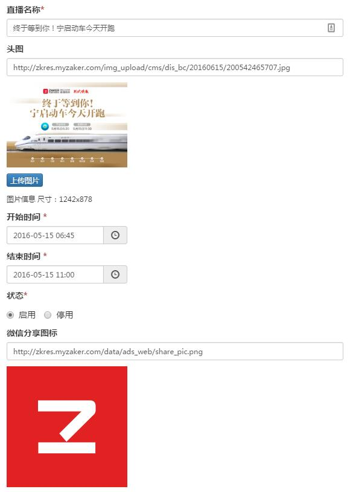
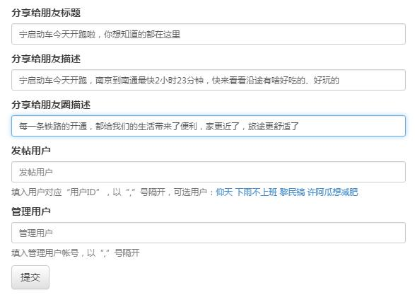
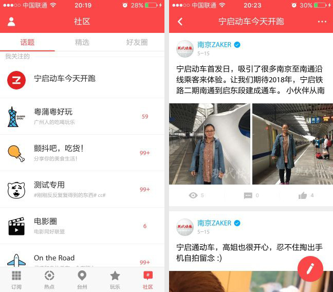
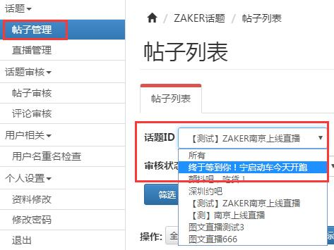
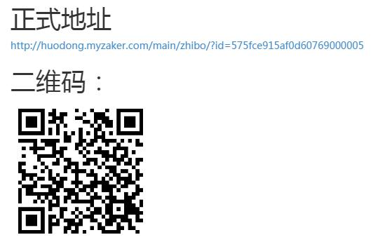

# 图文直播
- 实例：[终于等到你！宁启动车今天开跑](http://huodong.myzaker.com/main/zhibo/?id=5735d1019490cb0344000030)

- 图文直播用于报道进行中的事件，可以持续反应进展情况，具有较高的实时性。
- 基于 ZAKER社区的“话题”来生成，手机和后台都可以更新，既可以由前方记者单独报道，也可以由后方统一管理和指挥，搭配比较灵活。

## 一、前期准备
主要是准备好创建直播所需要的一些素材和文案：
1. **标题**
    - 如截图所示，直播标题会显示在顶部导航栏的中间，超过一定字数后会被省略；
    - 以主流机型中屏幕最小的 iPhone 5/5s 为例，最多能显示 12 个汉字。
2. **头图**
    - 建议尺寸是 1242 x 878；
    - 可自由调整（注意不要过大，影响加载速度），图片会自动撑满屏幕。
3. **开始时间/结束时间**
    - 直播未开始前会显示倒计时；
    - 结束后会提示“直播已结束”。
4. **微信分享图标和文案**
    - 直播页面分享给微信好友或分享到微信朋友圈时会用到；
    - 分享图标默认是 ZAKER logo，有需要可自行上传，建议尺寸不超过 400 x 400；
    - 分享给好友的标题、描述，分享到朋友圈的描述与[【专题分享信息】](chapter13-6.html)一致。

## 二、创建直播
1. 点击左上角的快捷入口【[▲ 社区后台](https://disvc.myzaker.com/)】或手动在浏览器输入https://disvc.myzaker.com 登录后台；
2. 点击左侧菜单中的【直播管理】，进入直播列表页面，列出了已创建的直播、包括直播信息和直播页面地址，并可进行筛选、修改等操作；

3. 点击右上角的【新建直播讨论】创建新直播，填入前期准备好的素材和文案，带*****号的为必填选项：

4. 最下面的**发帖用户**和**管理用户**用于设置哪些人可以更新和管理直播：
    - **发帖用户**
        - 发帖用户指可在手机上更新直播的用户；
        - 需填入用户对应的 ZAKER uid，即登录 ZAKER 客户端所使用帐号的 id，是若干位的数字，比如 2235；
        - 后台会自动列可选的发帖用户，点击昵称即可自动填入对应的 uid；
        - 多个 uid 之间**必须用英文逗号“,”**隔开；
        - 被设置为发帖用户的 ZAKER 用户，登录后进入 ZAKER - 社区 Tab - 话题子 Tab，可在顶部看到对应的话题（未设置的人看不到，普通用户也看不到），以发帖的方式更新直播内容：
        

    - **管理用户**
        - 管理用户指可在社区后台管理话题以及图文直播的用户；
        - 需填入用户对应的后台帐号，通常为姓名的拼音，比如如 chenlanlan；
        - 创建图文直播的当前用户，自动会设为管理用户，不需要手动填入；
        - 多个帐号之间**必须用英文逗号“,”**隔开；
        - 被设置为管理用户的帐号，登录社区后台后，点击左侧菜单中的【帖子管理】打开帖子列表页面，在【话题ID】下拉菜单中可看到图文直播对应的话题：
        

5. 完成所有设置后提交，新的图文直播即创建完成，返回直播列表，点击对应直播的【正式地址】，在弹出的页面中会显示直播页面地址（一个网页地址）以及对应的二维码：

请根据需要将直播投放到频道、专题或本地tab。

## 注意事项
如果有需要，大部分直播信息和配置可以再次调整修改，但“发帖用户”和“管理用户”这两项配置暂时还是一次性的。

因此，如果填错了或者想补充几个发帖用户或管理用户，都需要重新创建一个直播。

后续将进行优化改进，提供再次修改的功能。
