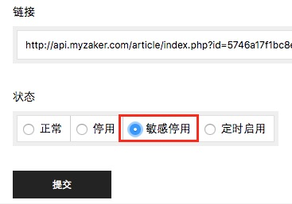
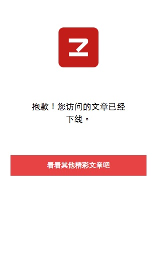

# 敏感停用文章

常规的停用文章，是让客户端不再输出这篇文章，也就是只影响停用之后进来阅读的用户，但如果这篇文章已经被分享到外部渠道，用户仍然是可以阅读的。

某些你懂的特殊情况，以及版权方强烈要求时，需要将已经分享出去的文章也下线，这时候就需要使用“敏感停用”功能。

## 一、操作
1. 敏感停用
  - 点击文章操作中的【修改】，打开修改文章页面，在最下面的【状态】一栏，选择【敏感停用】即可。
  

  - 操作生效后，在外部打开时会提示文章已下线：
  
2. 取消敏感停用
  - 文章被敏感停用后，在后台查看时和常规停用的文章一样，通过[筛选](chapter21.html)停用文章可以找到。
  - 找到文章后，同样进入修改页面，修改为其他状态即可。

## 二、说明
1. 由于缓存的存在，敏感停用和取消敏感停用，都需要5分钟左右才生效；
2. 文章处于置顶状态时，无法将其敏感停用，需要先取消置顶；