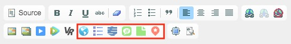
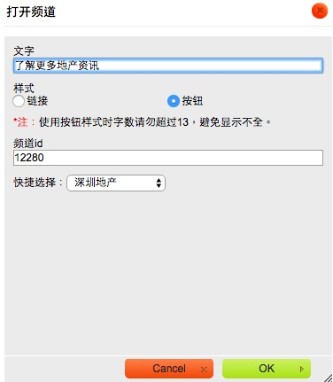
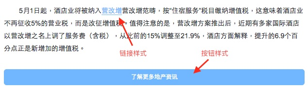

# 文章正文跳转

[文章跳转](chapter09.html)是在点击文章标题时进行跳转，不打开正文；

**文章正文跳转**则是通过在正文中插入跳转链接来打开其他类型的内容，首先打开正文，在用户点击链接后才跳转。

----

1. 在编辑器中新增了5个按钮，用于插入要跳转的内容链接，从左到右分别对应：

  - 网页
  - 频道
  - 专题
  - 话题
  - 帖子
  - 玩乐（活动和电影）

2. 以跳转频道为例，点击按钮后弹出配置窗口。

  - 文字：显示在跳转链接上的文字；
  - 样式
    - 链接：常见的超链接一样，可以插入到文字之间，不会切断文字；
    - 按钮：显示为蓝底白字的按钮，独立成行。
    
    > 使用按钮样式时，文字字数如果超过13个，在小屏幕上可能会换行，请尽量避免
  - 频道id：填入要跳转的频道的id；
  - 快捷选择：列出了本组织所管理的频道，在下拉列表中选择后会自动填入频道id。

3. 其他几种内容跳转需要配置的相应的跳转信息，如网页地址，专题id等，可参考[预览文章](chapter19.html)、[文章跳转](chapter09.html)等章节。

