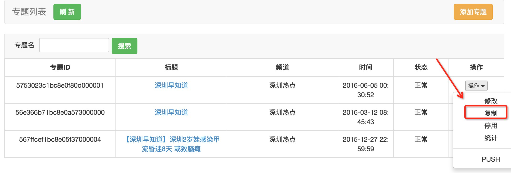
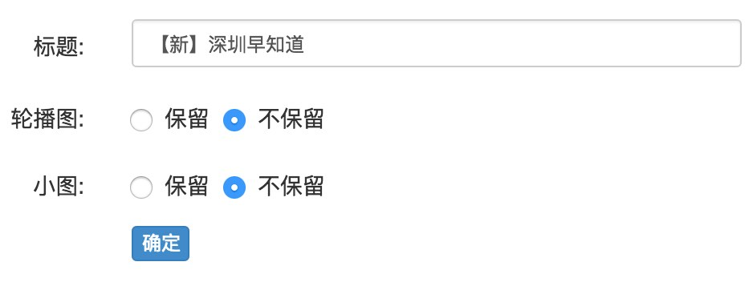
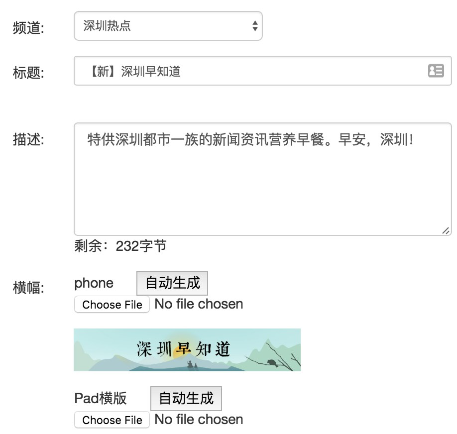

# 复制专题

周期性发布的固定专题（如深圳地区每天早上的《深圳早知道》）的特点是具有较稳定的框架，包括专题的标题、导语、分组、banner等基本设置是一样的，变化的主要是轮播图、小图和列表内容。

针对这种情况，可基于已有的专题进行复制，减少不必要的重复性劳动，提高运营效率。

----

1. 进入专题列表，选择要复制的专题，点击【操作】>【复制】：

2. 在弹出对话框中可对复制细节进行配置：

  - 默认生成标题为“**【新】+ 原专题标题**”，可自行修改；
  - 轮播图和小图默认不保留，有需要时可选择保留（比如专题小图固定投放了广告）；
  - 专题的标题、导语、分组、banner等默认保留。

3. 点击【确认】，复制生成的专题会出现在专题列表最上方。
4. 选择新生成的专题，点击【操作】>【修改】，可以看到基本设置已填好，开始更新专题内容即可。

