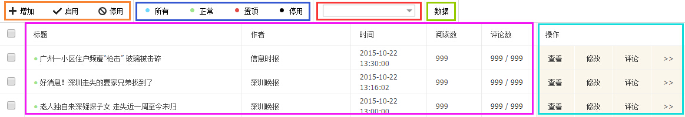

# 频道管理

1. 频道管理放在左侧菜单的**内容管理**模块，点击后可看到自己有权限管理的频道；

2. 点击进入频道后，右侧出现的即为频道频道管理页面，如下图：

  - 橙色框部分是文章管理，**增加**是发布新文章，**启用**是将停用状态的文章启用，**停用**是将其他状态的文章停用，处于停用状态的文章不会显示给用户看；
  - 蓝色框部分是文章筛选，按状态筛选列表中要显示的文章，共3种状态，以颜色区分，显示在文章标题前面，客户端上能看到的（也就是用户能看到的）只有正常和置顶状态的文章；
  - 红色框部分是文章搜索，输入关键词后可搜索该频道内标题中包含该关键词的文章，详情参看[搜索文章](chapter10.html)；
  - 绿色框部分是频道的数据统计入口，点击后将跳转，详情参看[数据统计](chapter14.html)；
  - 紫色框部分是文章列表，显示发布在该频道的文章，以发布时间排列，最新的在前；
  - 青色框部分是文章操作，默认显示**查看**、**修改**、和**评论**这三个频繁使用的功能，其他不常用的功能被折叠起来，需要时点击**>>**可展开。