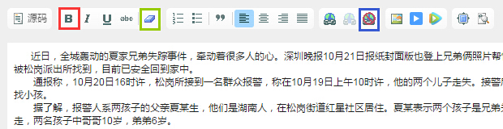

# 发布文章

1. 点击文章管理中的**增加**，页面中间会弹出新文章录入窗口。
2. 填入标题：

 * 字数建议控制在22个以内（这里指汉字，2个英文字母或数字=1个汉字，下同），在某些样式下，超出部分会被客户端省略；
 * 后台可看到字数提醒。

3. 填入摘要（必须是集成频道，普通频道由于设计独特，不兼容摘要的显示），字数建议控制在36个以内。
4. 填入文字内容：

  - 目前通过后台编辑器仅支持添加红色框中的**加粗**样式，其他如斜体、下划线等即使设置了也会被过滤；
  - 客户端会对页面进行统一的排版，通常情况下内容粘贴到后台后不需要再做处理，如果发现显示效果异常，可尝试全选内容，点击绿色框中**清除格式**和蓝色框中的**清除所有超链接**。

5. 添加图片：
  - 先空出一行作为图片插入的位置，如下图红色框部分；

  - 如果要添加网络图片，可在图片上**右键-复制图片**，直接ctrl+v将其粘贴到编辑器中；
  - 如果上述**复制-粘贴**方法不起作用，请点击上图蓝框中的**图片**按钮，弹出**图片属性**窗口，先复制图片的网络地址，填入**源文件**一栏后提交；

  - 如果要上传本地图片，切换到**上传**选项卡，点击**选择文件**然后选中本地图片，再点击**上传到服务器上**，提示上传成功后提交即可。

6. 填入作者，如果留空系统会显示作者为**未知**，**无特殊情况请不要留空！**
7. 选择发布时间：

 - 发布时间决定了这篇文章在列表中的排序，修改发布时间会改变排序；
 - 如果留空，则发布时间为自动设为提交时的时间；
 - 可手动修改时间（直接改那些数字），也可以使用输入框右侧的插件。

8. 填入链接：
 - 如果文章来自网络，则复制网络地址将其填入，点击客户端的**查看原文**时会跳转到来源网页；
 - 去重等功能依赖于链接的唯一性，**无特殊情况请不要留空！**。

9. 选择状态，状态决定了文章在客户端是否显示，以及什么时候显示：
 - 选择**停用**，文章不在客户端显示，仅出现在后台；
 - 选择**启用**，文章在客户端显示；
 - 选择**定时启用**，文章会在上一步填入的**发布时间**后在客户端显示；
 - 如果选了**定时启用**，但填入的发布时间比当前时间还要早，文章会立刻启用。

10. 检查无误后，点击**提交**即可发布新文章，提交后返回到频道管理页面，点击底部的页面刷新按钮就可以看到新文章。

