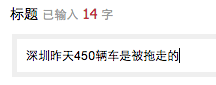
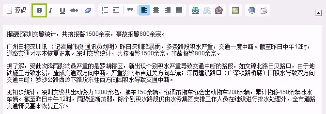
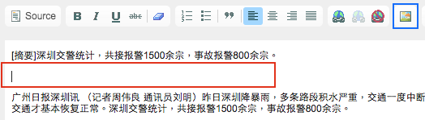
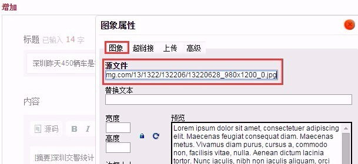
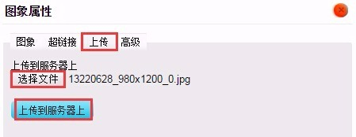
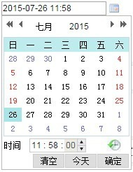
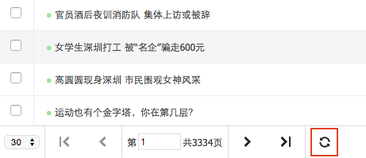

# 发布文章

1. 点击文章管理中的**增加**，页面中间会弹出新文章录入窗口
2. 填入标题 

 * 字数建议控制在22个以内（这里指汉字，长度上2个英文字母/数字=1个汉字），在某些样式下超出部分会被省略;

 * 后台可看到字数提醒；

3. 填入摘要（需客户端6.2.1以后版本支持，且频道必须是集成频道，普通频道没有空间显示摘要），字数建议控制在36个汉字以内。

4. 填入文字内容

  - 如果内容是从外部粘贴的（如 word 文档，网页等），粘贴后请全选内容，点击绿框中的**清除格式**按钮，客户端会根据定制配置进行转码和排版，清除外部来源的格式可降低发生错误的可能性；
  
  - 目前通过后台编辑器可添加的样式中，客户端只支持绿框的**加粗**，其他如斜体、下划线等即使设置了也会被过滤。

5. 添加图片
  - 先空出一行作为图片插入的位置，如下图红框部分；

  - 如果要添加网络图片，可在图片上**右键-复制图片**，直接ctrl+v将其粘贴到编辑器中；

  - 如果上述**复制-粘贴**方法不起作用（例如使用的是Mac系统），请点击上图蓝框中的**图片**按钮，弹出**图片属性**窗口，先复制图片的网络地址，填入**源文件**一栏后提交即可；

  - 如果要上传本地图片，切换到**上传**选项卡，点击**选择文件**然后选中本地图片，再点击**上传到服务器上**将其上传到服务器，提示上传成功后提交即可。

6. 填入作者
如果留空，系统会显示作者为**未知**，**无特殊情况请不要留空！**

7. 选择发布时间 

 - 如上文所述，发布时间决定了这篇文章在列表中的排序；
 
 - 如果留空，则发布时间为自动设为提交时的时间；
 
 - 可手动修改时间（直接改那些数字），也可以使用右侧红框中的时间选择插件。

8. 填入链接
 - 如果文章来自网络，则复制网络地址将其填入，点击客户端的**查看原文**按钮时会跳转到来源网页；
 
 - 如果留空，系统会自动生成一个链接地址，**无特殊情况请不要留空！**。

9. 选择状态
 - 状态决定了文章在客户端是否显示，以及什么时候显示；
 
 - 选择**停用**，文章不在客户端显示，仅出现在后台；
 
 - 选择**启用**，文章在客户端显示；
 
 - 选择**定时启用**，文章会在上一步填入的**发布时间**后在客户端显示（如果选了定时启用，但发布时间比当前时间还要早，文章会立刻启用，只有发布时间比当前时间晚时才会定时启用）。

10. 提交 

 - 检查无误后，点击**提交**即可发布新文章；
 
 - 提交后新文章录入窗口关闭，回到频道管理页面，点击页面底部红框中的页面刷新按钮，就可以看到刚才添加的新文章。

