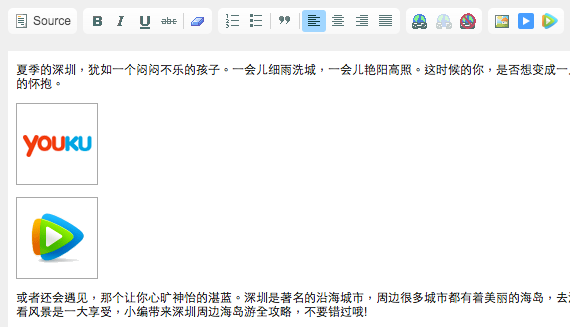
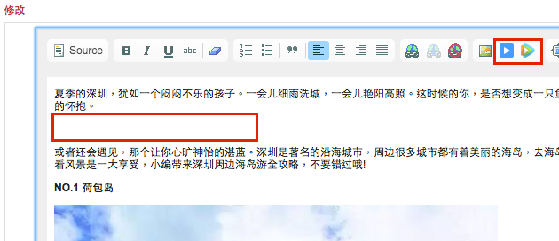
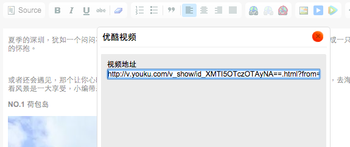

# 插入视频

在发布新文章或修改文章时，都可以在正文中插入视频，支持优酷视频和腾讯视频：
1. 与插入图片一样，需要为视频单独空出一行；

2. 在编辑器工具栏中点击优酷或腾讯的图标，复制视频页面的链接，粘贴到弹出窗口的**视频地址**一栏：

- 后台会自动解析，将视频 id 提取出来，如果提示地址解析错误，那就是地址不正确，比如复制了一个视频专辑的地址，而后台需要的是单个视频的地址，优酷和腾讯视频的地址范例如下，可对比参考：
     - 优酷：http://v.youku.com/v_show/id_XMTI5OTczOTAyNA==.html?from=y1.3-idx-uhome-1519-20887.205805-205902.9-1（包含 id_xxxx）
     
     - 腾讯：http://v.qq.com/cover/8/8r7wpmfxhfs0cj5.html?vid=a0017pbdjw9（包含 vid=xxxx）

3. 自动解析成功后，会在插入位置看到优酷或腾讯的图片，执行提交就完成了插入。 

