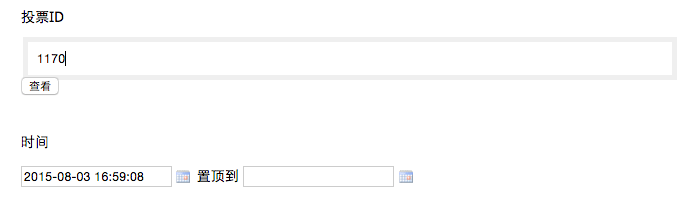
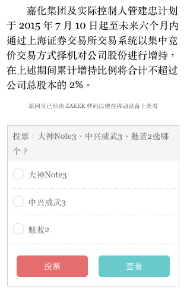

# 插入投票

投票只能在已经存在的文章上插入，所以在增加新文章时没有这个选项：
1. 点击文章操作中得**修改**，在**时间**上方有**投票 id **，需要填入一个投票 id；投票需要在另外的投票后台创建，暂时可由ZAKER 编辑配合创建，完成后提供投票 id 给到深圳 ZAKER 的编辑。

2. 填入投票 id 后，可点击**查看**预览投票，点击后将打开一个文章正文的预览页面，投票出现在底部；

 - 投票样式和位置目前都是固定的，全平台通用，后期会统一优化改进；
 
 - 下图预览图即在手机上查看的效果（需将浏览器宽度拉小，或切换到移动设备模式）

3. 确认无误后点击**提交**即可。

