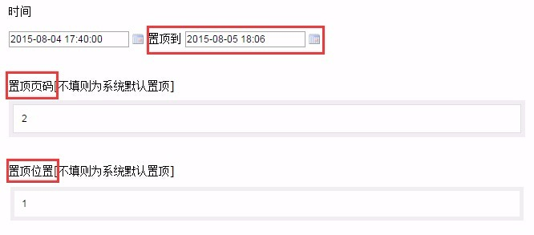
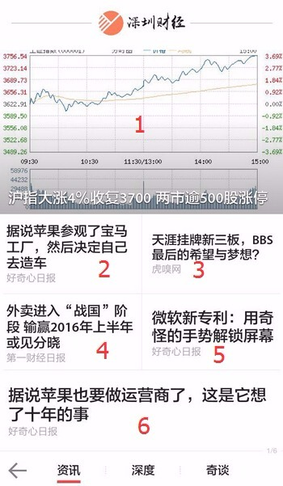

# 置顶文章
> 置顶功能可将文章固定在频道的前36个位置（每页6篇，共6页）。

1. 点击文章操作中的**修改**，在**时间**一项中设置置顶到哪个时间：

    - **置顶页码**的有效范围是1~6（对于集成频道来说，从上往下每6篇是一组，等同于一页）；
    - **置顶位置**的有效范围也是1~6：
      - 对于普通频道来说，显示封面图的位置是1，其他位置按从左到右+从上往下的原则排列；

      - 对于集成频道来说，每一组的位置是按从上往下的原则排列（比较简单就不附图了）。
    
2. **置顶页码**和**置顶位置**需要同时设置才生效，只设置其中一个，和系统默认置顶是一样的。

