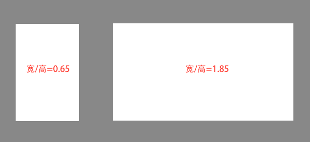
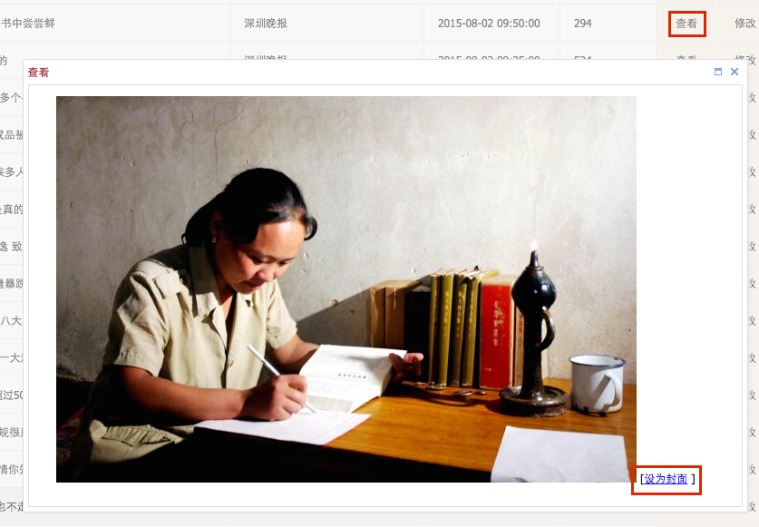
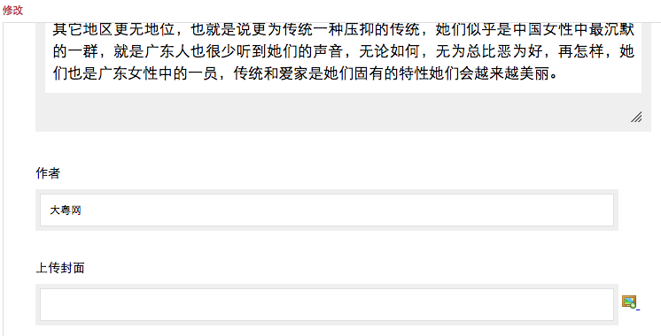
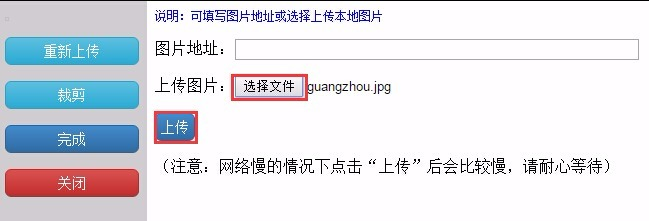
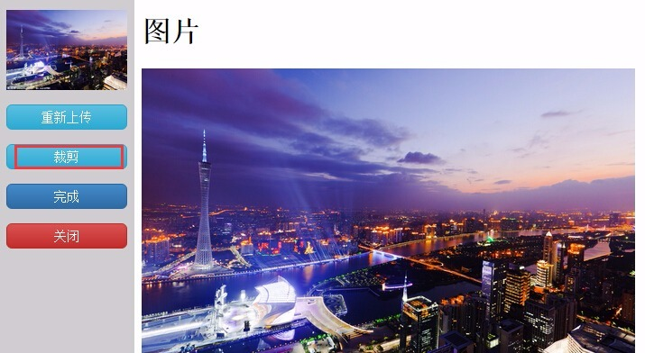
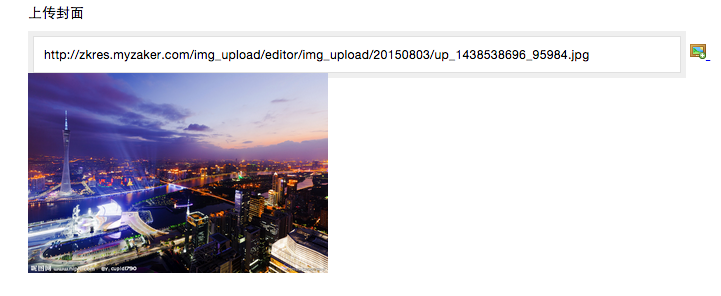

# 设置封面

1. 文章封面即显示在列表的缩略图，在没有无人工设置的情况下，文章封面由系统自动选择：
    - 对于普通频道（俗称豆腐块排版的频道）
        - 每6篇文章为1页，只有每页第1篇文章会显示封面，这个位置也称为焦点位；
        
        - 在没有人工置顶的情况下，系统会尽量让有图的文章排到焦点位，除非6篇文章都没有图；
        
        - 并非文章内有图就会作为封面，图片需满足```0.65<宽/高<1.85```才能作为候选封面，极限情况是下面的两个例子：


        - 默认情况下，文章内第一张符合看宽高比限制的图片会被选为封面。

    - 对于集成频道（以列表形式上下排列文章的频道）
        - 每6篇文章为一组，每组第1篇有可能显示大图封面，第2-5篇有可能显示小图或三图封面；
        
        - 图片同样需要满足```0.65<宽/高<1.85```才能作为候选封面；
        
        - 第1篇有候选封面时显示为大图，没有候选显示为无图；
        
        - 第2-5篇有1-2个候选封面时显示为单图，有3或3以上个候选封面时，在小图和三图间随机，没有候选也显示为无图。

2. 当文章有图但自动选出来的图片不适合作为封面时，可手动设置某一张图片作为封面：


    - 点击文章操作中的**查看**进行预览，此时可在每张图片右下角看到**设为封面**选项；
    
    - 点击该选项即可让这张图片成为封面，在不关闭窗口的情况下，可以在多张图片上点击，以最后的选择为准；
    
    - 想要取消人工选择的封面，恢复系统自动选择，需要关闭窗口后再次**查看**，此时已被设为封面的图片对应的选项变成**取消封面**；
    
    - 这种人工选择封面的操作是无视图片宽高比限制的，也就是说，比例多夸张的图片都会被强制设为封面；
    
    - 对于普通频道来说，是否显示封面是由位置决定的，人工选择了封面并不会影响位置；
    
    - 对于集成频道来说，如果人工选择了封面，第1篇文章的封面一定显示为大图，第2-5篇一定显示为小图。

3. 当文章无图，或者文章内所有图片都不适合作为封面时，可选择上传图片作为封面：
    - 点击文章操作中的**修改**，在作者一栏下面有**上传封面**的选项，点击图片 icon；


    - 在弹出窗口中点击**选择文件**，然后选择本地的一张图片，再点击**上传**将其上传到服务器；


    - 上传成功后可看到图片预览，在不关闭上传窗口的情况下还可以做进一步操作：
    
        - 点击**重新上传**可再次选择图片；
        
        - 点击**裁剪**可对图片进行调整，例如图片比例不合适或者图片体积过大；

    - 点击**完成**，在修改窗口中可以看到已上传和调整的封面，确认无问题后提交即可；


    - 对于普通频道来说，是否显示封面是由位置决定的，人工上传了封面并不会影响位置；
    - 对于集成频道来说，如果人工上传了封面，第1篇文章的封面一定显示为大图，第2-5篇一定显示为小图。
    - ```人工上传的优先级高于人工选择```，即两种设置都存在的情况下，使用上传的图片作为封面。

