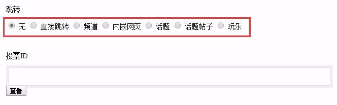
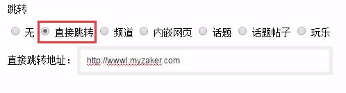
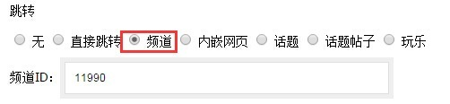
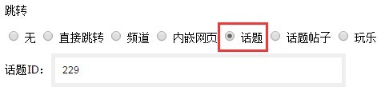
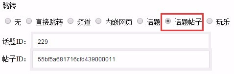
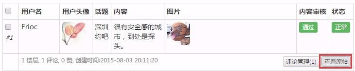
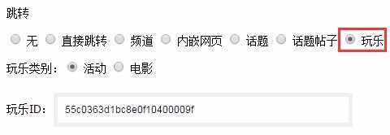

# 文章跳转

列表跳转指的是在频道列表点击某一篇文章时，不是打开文章正文，而是跳转其他类型的页面，满足运营中的推广导量需求，也可以兼容第三方提供的内容。

1. 设置列表跳转需要绑定一篇已存在的文章，所以 和插入投票一样，增加新文章没有这个选项。点击文章操作中的**修改**，在**上传封面**下有一个选项**跳转**，默认选中**无**，即不做跳转，点击列表的文章标题时是打开文章正文；


2. 选中**直接跳转**，表示点击列表的文章标题时，将跳转一个网页，请在下方输入框填入要跳转的网页地址；


3. 选中**频道**，表示点击列表的文章标题时，将跳转一个频道，请在下方输入框填入要跳转的频道id：


    - 跳转频道通常用于流量大的频道给流量小的频道导流；
    
    - 深圳ZAKER所运营频道的id分别为：深圳热点（```10055```）和深圳财经（```11990```）。

4. **内嵌网页**是插入视频和投票后使用的跳转方式，后台会自动设置，不需要人工操作。

5. 选中**话题**，表示点击列表的文章标题时，将跳转一个话题，请在下方输入框填入要跳转的话题id：

    - 深圳ZAKER所运营话题的id为：深圳约吧（```229```）；
    
    - 如果有跳转其他话题的需要，可联系话题组的同学。

6. 选中**话题帖子**，表示点击列表的文章标题时，将跳转一个话题帖子，请在下方输入框填入要跳转的话题帖子id和所属话题id：


    - 话题帖子id和所属话题id 需要在话题后台获取，在话题后台找到要跳转的帖子，点击**查看原帖**； 


    - 在打开的帖子正文页面的地址栏中，```discussion_id```就是话题id，```post_id```为帖子id。


    - 如果有跳转其他话题帖子的需要，可联系话题组的同学。

7. 选中**玩乐**，表示点击列表的文章标题时，将跳转一个玩乐活动，请在下方选择活动类型和活动id，由于深圳ZAKER暂时不会独立运营玩乐业务，有需要的时候和玩乐组的同学配合即可。


